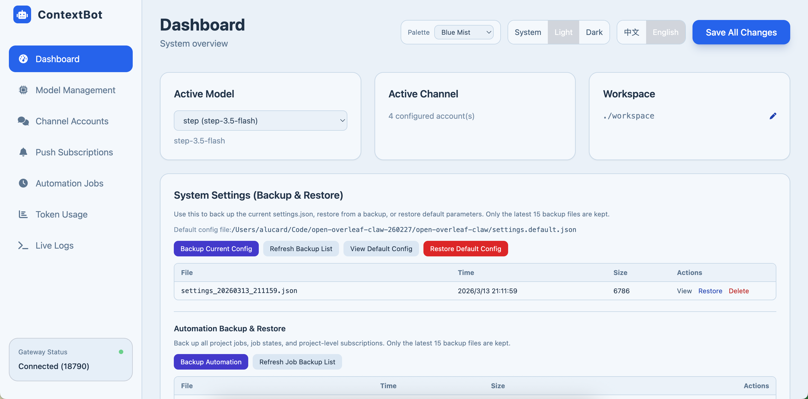
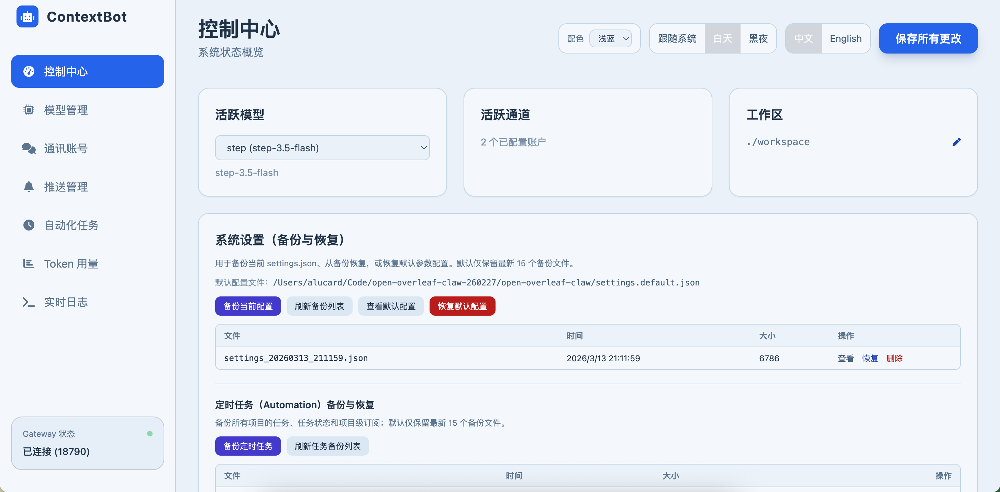

<div align="center">

# Open Overleaf Claw

**Your personal AI research assistant. Any paper. Any venue. The academic claw. 🦞**

A self-hosted AI assistant for academic research — manages your papers, searches literature, tracks deadlines, and answers you on the channels you already use.

你自己的 AI 学术研究助手 — 管理论文、检索文献、追踪截稿日期，在你常用的渠道随时响应。

[](https://www.python.org/downloads/)
[](LICENSE)

<!-- TODO: 在此放置产品演示 GIF 或视频 -->

<video controls width="600">
  <source src="https://github.com/nanoAgentTeam/open-overleaf-claw/raw/refs/heads/main/README/video/openoverleaf.mp4" type="video/mp4">
  Demo
</video>
<!--  -->

**[English](#english)** · **[中文](#中文)**

</div>

---

# English

## What is Open Overleaf Claw?

Open Overleaf Claw is a personal AI research assistant you run on your own machine. It manages your LaTeX projects, syncs with Overleaf, searches literature, tracks deadlines — and answers you on the channels you already use (CLI, Web UI, Telegram, Feishu, QQ, DingTalk). Instead of switching between your editor, Overleaf, terminal, and search engine, you talk to one assistant that handles it all:

```
You: Create a paper project "MoE-Survey" and link it to Overleaf.
Bot: ✅ Project created. Overleaf linked. Switched to MoE-Survey.

You: Research the latest MoE papers and draft an introduction.
Bot: 🔎 Searching arXiv... 📝 Writing introduction... ✅ Compiled successfully.

You: /sync push
Bot: ✅ Pushed 3 files to Overleaf.
```

<!-- TODO: 在此放置 CLI 会话截图 -->


<!--  -->

## Key Features

**Writing & Compilation**

- Read, write, and refactor `.tex` / `.bib` files through chat
- One-command LaTeX compilation with automatic error diagnosis
- Built-in venue skills for NeurIPS, ICML, ICLR, AAAI, ACL, CVPR, and more

**Overleaf & Git**

- Bidirectional Overleaf sync — pull edits, push changes, no browser needed
- Every AI edit auto-committed to Git — roll back any change in seconds
- Interactive `/git` mode for history, diff, and rollback

**Multi-Agent Collaboration**

- Delegate research, writing, and review to specialized sub-agents
- Sub-agents work in isolated sandboxes — no accidental file overwrites
- `/task` mode decomposes complex goals into a DAG and executes in parallel

**Literature Search**

- arXiv, PubMed, OpenAlex, Semantic Scholar integration
- Full-text PDF reading for in-depth analysis

**Research Radar & Automation**

- Scheduled tasks that automatically track your research field — new papers, trending topics, deadline alerts
- Daily scans, weekly digests, direction-drift detection — all running unattended
- Results pushed to Telegram, Feishu, DingTalk, Email, or any Apprise-compatible channel
- Configure via Web UI or `project.yaml` — each project has its own radar schedule

**Memory & Context**

- Project-level memory — the agent remembers your research topics, preferences, and prior work across sessions
- Automated context summarization to stay within token limits without losing information
- Memory-powered automation — scheduled tasks read/write project memory for continuity

**Access Anywhere**

- **Web UI** — browser-based dashboard for configuration and monitoring
- **CLI** — full-featured interactive terminal
- **IM Bots** — Feishu (Lark), Telegram, QQ, DingTalk — no public IP required

<!-- TODO: 在此放置 Web UI 截图 -->



<!--  -->

## Getting Started

### Install

```bash
git clone https://github.com/nanoAgentTeam/open-overleaf-claw.git
cd open-overleaf-claw

python3 -m venv .venv
source .venv/bin/activate
pip install -r requirements.txt
```

### Configure (via Web UI)

```bash
# Start the gateway — this launches the Web UI
python cli/main.py gateway --port 18790
```

Open **http://localhost:18790/ui** in your browser:

1. **Provider Management** — Add your LLM provider (API Key, model name, base URL). Any OpenAI-compatible API works (GPT, DeepSeek, Qwen, Claude, etc.)
2. **Channel Accounts** — *(optional)* Add IM bot credentials (Feishu / Telegram / QQ / DingTalk)
3. **Push Subscriptions** — *(optional)* Configure where automation results get delivered

> All settings are stored in `settings.json`. Advanced users can edit this file directly — see [Configuration Reference](#configuration-reference).

<!-- TODO: 在此放置 Web UI 配置页面截图 -->


<!--  -->

### Use

**Option A — CLI** (interactive terminal):

```bash
python cli/main.py agent
```

**Option B — Gateway** (Web UI + IM bots):

```bash
python cli/main.py gateway --port 18790
```

**Option C — Overleaf sync** *(optional)*:

```bash
pip install overleaf-sync
ols login          # generates .olauth cookie file
```

## How It Works

### Workspaces

The system has two spaces:

|                 | Default (Lobby)                          | Project (Workspace)                                             |
| --------------- | ---------------------------------------- | --------------------------------------------------------------- |
| Purpose         | Create, list, switch projects            | Work on a specific paper                                        |
| Available tools | Project management, Overleaf list/create | File editing, LaTeX compile, Git, sub-agents, literature search |

```
workspace/
├── Default/                    # Lobby — project management & chat
└── MyPaper/
    ├── project.yaml            # Project config
    ├── MyPaper/                # Core directory (LaTeX files + Git repo)
    │   ├── main.tex
    │   └── references.bib
    └── 0314_01/                # Session (conversation history, sub-agent workspace)
```

### Commands

| Command          | What it does                                                 |
| ---------------- | ------------------------------------------------------------ |
| `/task <goal>` | Decompose a complex goal into sub-tasks, execute in parallel |
| `/compile`     | Compile LaTeX to PDF                                         |
| `/sync pull`   | Pull latest files from Overleaf                              |
| `/sync push`   | Push local changes to Overleaf                               |
| `/git`         | Enter interactive Git mode (history, diff, rollback)         |
| `/reset`       | Clear current session history                                |
| `/back`        | Return to Default lobby                                      |
| `/done`        | Exit current mode (Task / Git)                               |

### Task Mode

For multi-step goals, `/task` breaks work into phases:

```
/task Write a survey on Mixture-of-Experts

→ UNDERSTAND    Bot reads your project files
→ PROPOSE       Bot generates a proposal for review
→ PLAN          Bot builds a task DAG for confirmation
→ EXECUTE       Sub-agents run tasks in parallel batches
→ FINALIZE      Bot merges all outputs, commits, and auto-exits
```

<!-- TODO: 在此放置 Task 模式执行截图 -->


<!--  -->

### Multi-Agent Collaboration

```
You: "Write a paper about MoE"

Main Agent:
  1. Creates "researcher" sub-agent → searches literature in sandbox
  2. Creates "writer" sub-agent → drafts sections in sandbox
  3. Reviews and merges outputs into project
  4. Compiles and syncs to Overleaf
```

Sub-agents work in isolated overlay directories. Their outputs go through a merge process before touching the project core — no accidental overwrites.

### Automation & Research Radar

Each project can have scheduled tasks that run automatically via cron expressions. Configure them through the Web UI's **Automation** tab or via `project.yaml`.

**Built-in radar jobs** (auto-created when a project is linked to Overleaf):

| Job                        | What it does                                                             | Default Schedule |
| -------------------------- | ------------------------------------------------------------------------ | ---------------- |
| **Daily Scan**       | Search for new papers in the project's research area, summarize findings | Every morning    |
| **Direction Drift**  | Detect if the research field is shifting, alert on emerging trends       | Daily            |
| **Deadline Watch**   | Track upcoming conference deadlines relevant to the project              | Daily            |
| **Conference Track** | Monitor new calls-for-papers from target venues                          | Weekly           |
| **Weekly Digest**    | Compile a weekly summary of all radar findings                           | Monday morning   |
| **Profile Refresh**  | Update the project's research profile based on latest edits              | Daily            |
| **Autoplan**         | Reconcile and adjust radar job schedules based on project state          | Twice daily      |

**How it works:**

1. Gateway starts the APScheduler automation runtime
2. Each job fires at its cron schedule, spawns an agent session with the job's prompt
3. The agent reads project memory, runs searches, writes findings to project files
4. Results are pushed to configured notification channels (Telegram, Feishu, Email, etc.)

**Push notifications** — configure in Web UI under **Push Subscriptions**. Supports Telegram, Feishu, DingTalk, Email (SMTP), and any Apprise-compatible URL.

<!-- TODO: Add Web UI automation tab screenshot -->


<!--  -->

### Architecture

```
┌──────────────────────────────────────────────────┐
│  CLI  /  Web UI  /  Feishu  /  Telegram  /  QQ   │
└────────────────────┬─────────────────────────────┘
                     │
               ┌─────▼─────┐
               │ MessageBus │
               └─────┬─────┘
                     │
            ┌────────▼────────┐
            │   AgentLoop     │──→ CommandRouter
            │  (Main Agent)   │──→ ContextManager
            └──┬──────────┬───┘
               │          │
     ┌─────────▼──┐  ┌───▼──────────┐
     │ToolRegistry│  │  Sub-Agents  │
     │ (40+ tools)│  │  (Workers)   │
     └─────┬──────┘  └──────────────┘
           │
     ┌─────┼──────────────────┐
     ▼     ▼                  ▼
  Project  LLM Provider   Automation
  (Git,    (OpenAI-compat, (Scheduled
  LaTeX,   hot-swappable)  cron jobs)
  Overleaf)
```

## Configuration Reference

All runtime config lives in `settings.json` (managed via Web UI, or edit directly):

| Section                | Purpose                                        |
| ---------------------- | ---------------------------------------------- |
| `provider.instances` | LLM providers — API key, base URL, model name |
| `channel.accounts`   | IM bot credentials                             |
| `gateway`            | Web UI host & port                             |
| `features`           | Toggle history, memory, auto-summarize, etc.   |
| `tools`              | Web search & academic tool API keys            |
| `pushSubscriptions`  | Automation notification routing                |

Other config files:

| File                                 | Purpose                                               |
| ------------------------------------ | ----------------------------------------------------- |
| `config/tools.json`                | Tool registry (class paths, parameters, permissions)  |
| `config/commands.json`             | Slash command definitions                             |
| `config/agent_profiles/`           | Agent role profiles (tools available per role)        |
| `workspace/{project}/project.yaml` | Per-project settings (Overleaf ID, LaTeX engine, Git) |

## Documentation

| Guide                                                             |                                                             |
| ----------------------------------------------------------------- | ----------------------------------------------------------- |
| [Project Overview](README/guide/01_项目概览.md)                      | [English](README/guide/01_Overview_en.md)                      |
| [Workspace &amp; Sessions](README/guide/02_工作空间与Session.md)     | [English](README/guide/02_Workspace_and_Session_en.md)         |
| [Agent Collaboration](README/guide/03_Agent协作.md)                  | [English](README/guide/03_Agent_Collaboration_en.md)           |
| [Isolation &amp; Security](README/guide/04_项目隔离与安全.md)        | [English](README/guide/04_Isolation_and_Security_en.md)        |
| [Git Version Control](README/guide/05_Git版本管理.md)                | [English](README/guide/05_Git_Version_Control_en.md)           |
| [Overleaf Sync](README/guide/06_Overleaf同步.md)                     | [English](README/guide/06_Overleaf_Sync_en.md)                 |
| [Usage Guide](README/guide/07_使用指南.md)                           | [English](README/guide/07_Usage_Guide_en.md)                   |
| [Configuration &amp; Quick Start](README/guide/08_配置与快速开始.md) | [English](README/guide/08_Configuration_and_Quick_Start_en.md) |
| [Web UI Guide](README/guide/webui操作手册.md)                        | [English](README/guide/webui_guide_en.md)                      |

### IM Setup Guides

- [Feishu (Lark)](README/im_config/Feishu_EN.md) · [Telegram](README/im_config/Telegram_EN.md) · [QQ](README/im_config/QQBot_EN.md) · [DingTalk](README/im_config/DingTalk_EN.md)

### Push Subscriptions Guides

- [Push Subscriptions Guides](README/im_config/add_notifaction_EN.md)

## Contributing

Contributions welcome! Please submit issues and pull requests.

## License

MIT License — see [LICENSE](LICENSE).

---

# 中文

## Open Overleaf Claw 是什么？

Open Overleaf Claw 是一个运行在你自己机器上的 AI 学术研究助手。它管理你的 LaTeX 论文项目，同步 Overleaf，检索文献，追踪截稿日期——并在你常用的渠道随时响应（CLI、Web UI、Telegram、飞书、QQ、钉钉）。不再需要在编辑器、Overleaf、终端和搜索引擎之间来回切换：

```
You: 创建一个叫 "MoE-Survey" 的论文项目，并关联 Overleaf
Bot: ✅ 项目已创建，Overleaf 已关联，已切换到 MoE-Survey。

You: 调研最新的 MoE 论文并写一个 Introduction
Bot: 🔎 搜索 arXiv... 📝 撰写 Introduction... ✅ 编译通过。

You: /sync push
Bot: ✅ 已推送 3 个文件到 Overleaf。
```

<!-- TODO: 在此放置 CLI 会话截图 -->


<!--  -->

## 核心功能

**写作与编译**

- 通过对话读写和重构 `.tex` / `.bib` 文件
- 一键 LaTeX 编译，自动诊断并修复错误
- 内置 NeurIPS、ICML、ICLR、AAAI、ACL、CVPR 等会议模板 Skill

**Overleaf 与 Git**

- Overleaf 双向同步 — 拉取编辑、推送变更，无需浏览器
- 每次 AI 编辑自动 Git 提交 — 几秒内回滚任何变更
- 交互式 `/git` 模式，查看历史、对比差异、一键回退

**多 Agent 协作**

- 将调研、写作、审阅委派给专门的子 Agent
- 子 Agent 在隔离沙箱中工作 — 不会意外覆盖文件
- `/task` 模式将复杂目标分解为 DAG 并行执行

**文献检索**

- 集成 arXiv、PubMed、OpenAlex、Semantic Scholar
- 支持 PDF 全文阅读和深度分析

**研究雷达与自动化**

- 定时任务自动追踪研究领域 — 新论文、热点趋势、截稿提醒
- 每日扫描、周报汇总、方向漂移检测 — 全部无人值守运行
- 结果推送到 Telegram、飞书、钉钉、邮件或任何 Apprise 兼容渠道
- 通过 Web UI 或 `project.yaml` 配置 — 每个项目有独立的雷达计划

**记忆与上下文**

- 项目级记忆 — Agent 跨 Session 记住你的研究方向、偏好和先前工作
- 自动上下文摘要，在 token 限制内不丢失关键信息
- 记忆驱动的自动化 — 定时任务读写项目记忆，保持工作连续性

**随时随地访问**

- **Web UI** — 浏览器端仪表盘，配置和监控
- **CLI** — 全功能交互式终端
- **IM 机器人** — 飞书、Telegram、QQ、钉钉 — 无需公网 IP

<!-- TODO: 在此放置 Web UI 截图 -->



<!--  -->

## 快速开始

### 安装

```bash
git clone https://github.com/nanoAgentTeam/open-overleaf-claw.git
cd open-overleaf-claw

python3 -m venv .venv
source .venv/bin/activate
pip install -r requirements.txt
```

### 配置（通过 Web UI）

```bash
# 启动 Gateway — 包含 Web UI
python cli/main.py gateway --port 18790
```

打开浏览器访问 **http://localhost:18790/ui**：

1. **模型管理** — 添加 LLM 提供商（API Key、模型名、Base URL）。支持任何 OpenAI 兼容 API（GPT、DeepSeek、通义千问、Claude 等）
2. **通讯账号** — *（可选）* 添加 IM 机器人凭证（飞书 / Telegram / QQ / 钉钉）
3. **推送订阅** — *（可选）* 配置自动化结果投递渠道

> 所有配置存储在 `settings.json` 中。高级用户也可以直接编辑该文件 — 参见[配置参考](#配置参考)。


<!--  -->

### 使用

**方式 A — CLI**（交互式终端）：

```bash
python cli/main.py agent
```

**方式 B — Gateway**（Web UI + IM 机器人）：

```bash
python cli/main.py gateway --port 18790
```

**方式 C — Overleaf 同步**（可选）：

```bash
pip install overleaf-sync
ols login          # 生成 .olauth 认证文件
```

## 工作原理

### 工作空间

系统有两个空间：

|          | Default（大厅）              | Project（工作间）                             |
| -------- | ---------------------------- | --------------------------------------------- |
| 用途     | 创建、列出、切换项目         | 在具体论文项目中工作                          |
| 可用工具 | 项目管理、Overleaf 列表/创建 | 文件编辑、LaTeX 编译、Git、子 Agent、文献检索 |

```
workspace/
├── Default/                    # 大厅 — 项目管理和聊天
└── MyPaper/
    ├── project.yaml            # 项目配置
    ├── MyPaper/                # Core 目录（LaTeX 文件 + Git 仓库）
    │   ├── main.tex
    │   └── references.bib
    └── 0314_01/                # Session（对话历史、子 Agent 工作区）
```

### 命令一览

| 命令             | 功能                                    |
| ---------------- | --------------------------------------- |
| `/task <目标>` | 将复杂目标分解为子任务，并行执行        |
| `/compile`     | 编译 LaTeX 生成 PDF                     |
| `/sync pull`   | 从 Overleaf 拉取最新文件                |
| `/sync push`   | 推送本地修改到 Overleaf                 |
| `/git`         | 进入交互式 Git 模式（历史、差异、回退） |
| `/reset`       | 清空当前 Session 对话历史               |
| `/back`        | 返回 Default 大厅                       |
| `/done`        | 退出当前模式（Task / Git）              |

### Task 模式

面对多步骤目标，`/task` 将工作分为阶段：

```
/task 写一篇关于 Mixture-of-Experts 的综述

→ UNDERSTAND    Bot 阅读项目文件，理解上下文
→ PROPOSE       Bot 生成方案供审阅
→ PLAN          Bot 构建任务 DAG，等待确认
→ EXECUTE       子 Agent 按批并行执行
→ FINALIZE      Bot 合并产出、提交，自动退出
```


<!--  -->

### 多 Agent 协作

```
You: "写一篇关于 MoE 的论文"

主 Agent:
  1. 创建 "researcher" 子 Agent → 在沙箱中检索文献
  2. 创建 "writer" 子 Agent → 在沙箱中撰写章节
  3. 审阅并合并产出到项目中
  4. 编译并同步到 Overleaf
```

子 Agent 在隔离的 overlay 目录中工作，产出需要经过 merge 流程才能进入项目核心目录 — 不会意外覆盖。

### 自动化与研究雷达

每个项目可配置定时任务，通过 cron 表达式自动执行。在 Web UI 的**自动化任务**页面或 `project.yaml` 中配置。

**内置雷达任务**（关联 Overleaf 后自动创建）：

| 任务                   | 功能                                 | 默认频率 |
| ---------------------- | ------------------------------------ | -------- |
| **每日扫描**     | 搜索项目研究方向的新论文，总结发现   | 每天早上 |
| **方向漂移检测** | 检测研究领域是否出现新趋势，提醒关注 | 每天     |
| **截稿日期监控** | 追踪与项目相关的会议截稿时间         | 每天     |
| **会议征稿追踪** | 监控目标会议的最新征稿通知           | 每周     |
| **周报汇总**     | 汇总本周所有雷达发现                 | 每周一   |
| **研究画像刷新** | 根据最新编辑更新项目研究画像         | 每天     |
| **自动规划**     | 根据项目状态自动调整雷达任务计划     | 每天两次 |

**工作原理：**

1. Gateway 启动时初始化 APScheduler 自动化运行时
2. 每个任务按 cron 计划触发，生成一个独立的 Agent 会话执行任务 prompt
3. Agent 读取项目记忆，执行搜索，将发现写入项目文件
4. 结果推送到配置的通知渠道（Telegram、飞书、邮件等）

**推送通知** — 在 Web UI 的**推送订阅**中配置。支持 Telegram、飞书、钉钉、邮件（SMTP）及任何 Apprise 兼容地址。


<!--  -->

### 架构

```
┌──────────────────────────────────────────────────┐
│  CLI / Web UI / 飞书 / Telegram / QQ / 钉钉      │
└────────────────────┬─────────────────────────────┘
                     │
               ┌─────▼─────┐
               │ MessageBus │
               └─────┬─────┘
                     │
            ┌────────▼────────┐
            │   AgentLoop     │──→ CommandRouter
            │  （主 Agent）    │──→ ContextManager
            └──┬──────────┬───┘
               │          │
     ┌─────────▼──┐  ┌───▼──────────┐
     │ToolRegistry│  │  子 Agents   │
     │ (40+ 工具) │  │  (Workers)   │
     └─────┬──────┘  └──────────────┘
           │
     ┌─────┼──────────────────┐
     ▼     ▼                  ▼
  Project  LLM Provider   Automation
  (Git,    (OpenAI 兼容,   (定时任务,
  LaTeX,   热切换)         cron)
  Overleaf)
```

## 配置参考

所有运行时配置在 `settings.json` 中（通过 Web UI 管理，或直接编辑）：

| 配置段                 | 用途                                    |
| ---------------------- | --------------------------------------- |
| `provider.instances` | LLM 提供商 — API Key、Base URL、模型名 |
| `channel.accounts`   | IM 机器人凭证                           |
| `gateway`            | Web UI 主机和端口                       |
| `features`           | 开关：历史、记忆、自动摘要等            |
| `tools`              | Web 搜索和学术工具 API Key              |
| `pushSubscriptions`  | 自动化通知路由                          |

其他配置文件：

| 文件                              | 用途                                       |
| --------------------------------- | ------------------------------------------ |
| `config/tools.json`             | 工具注册表（class 路径、参数、权限）       |
| `config/commands.json`          | 斜杠命令定义                               |
| `config/agent_profiles/`        | Agent 角色 Profile（各角色可用工具）       |
| `workspace/{项目}/project.yaml` | 项目级配置（Overleaf ID、LaTeX 引擎、Git） |

## 文档

| 指南                                                    |                                                             |
| ------------------------------------------------------- | ----------------------------------------------------------- |
| [项目概览](README/guide/01_项目概览.md)                    | [English](README/guide/01_Overview_en.md)                      |
| [工作空间与 Session](README/guide/02_工作空间与Session.md) | [English](README/guide/02_Workspace_and_Session_en.md)         |
| [Agent 协作](README/guide/03_Agent协作.md)                 | [English](README/guide/03_Agent_Collaboration_en.md)           |
| [项目隔离与安全](README/guide/04_项目隔离与安全.md)        | [English](README/guide/04_Isolation_and_Security_en.md)        |
| [Git 版本管理](README/guide/05_Git版本管理.md)             | [English](README/guide/05_Git_Version_Control_en.md)           |
| [Overleaf 同步](README/guide/06_Overleaf同步.md)           | [English](README/guide/06_Overleaf_Sync_en.md)                 |
| [使用指南](README/guide/07_使用指南.md)                    | [English](README/guide/07_Usage_Guide_en.md)                   |
| [配置与快速开始](README/guide/08_配置与快速开始.md)        | [English](README/guide/08_Configuration_and_Quick_Start_en.md) |
| [Web 界面功能说明](README/guide/webui操作手册.md)          | [English](README/guide/webui_guide_en.md)                      |

### IM 配置指南

- [飞书](README/im_config/feishu_ZH.md) · [Telegram](README/im_config/Telegram_ZH.md) · [QQ](README/im_config/QQBot_ZH.md) · [钉钉](README/im_config/DingTalk_ZH.md)

### 推送订阅配置指南

- [推送订阅配置指南](README/im_config/add_notifaction_ZH.md)

## 参与贡献

欢迎贡献！请提交 Issue 和 Pull Request。

## 许可证

MIT License — 详见 [LICENSE](LICENSE)。
