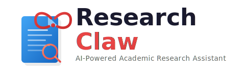
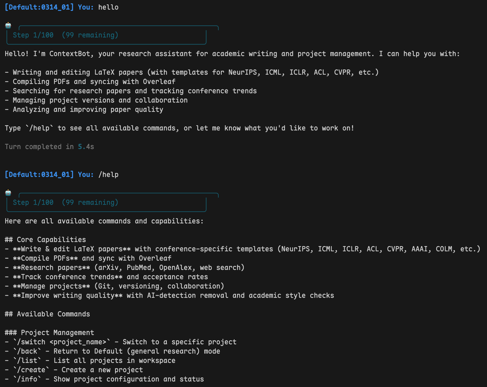
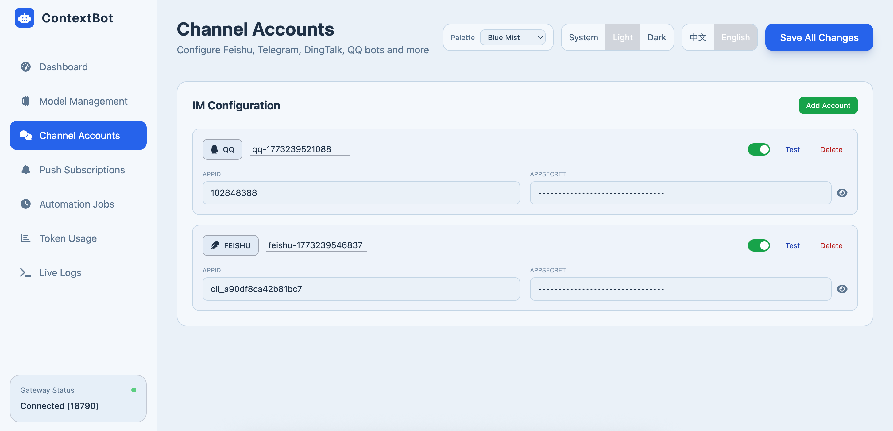
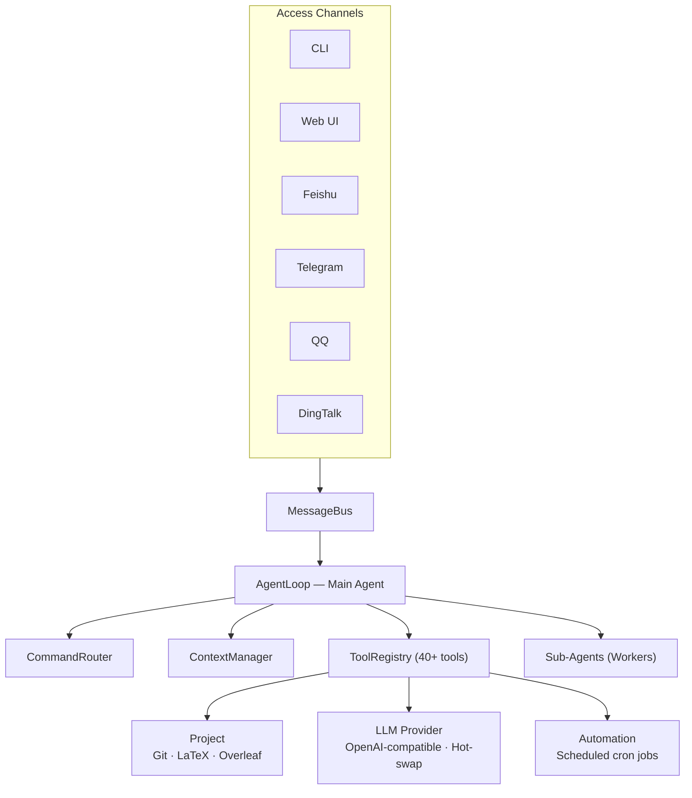
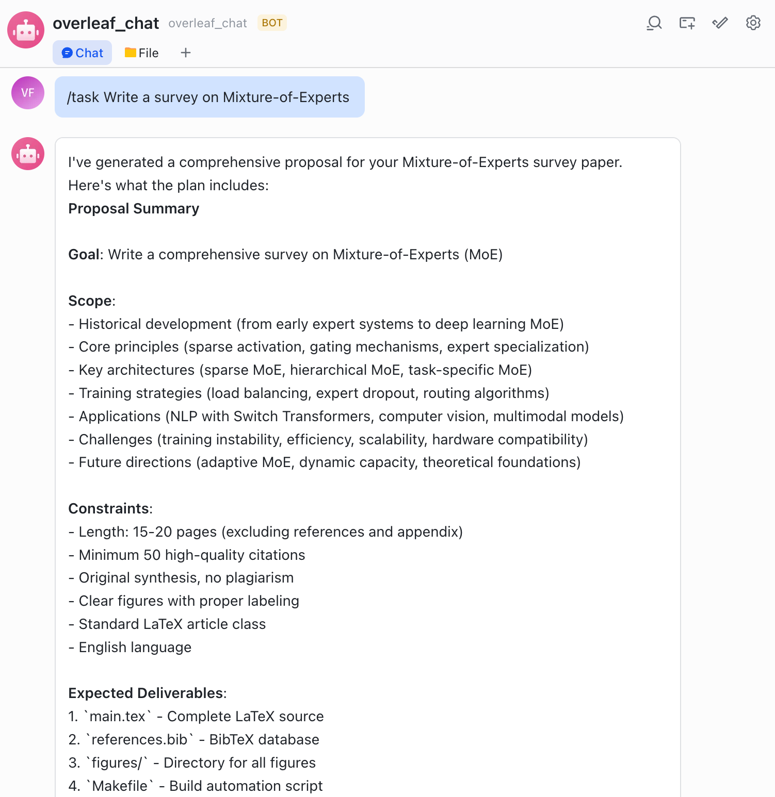
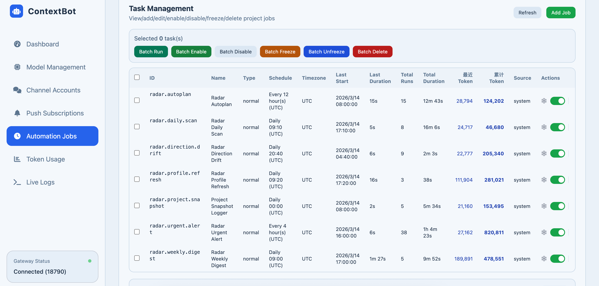

<div align="center">

<picture>
  <source media="(prefers-color-scheme: dark)" srcset="README/images/logo-dark.svg">
  <source media="(prefers-color-scheme: light)" srcset="README/images/logo.svg">
  
</picture>

<br><br>

**Your self-hosted AI research assistant — manage papers, search literature, track deadlines, and collaborate across channels.**

[](https://www.python.org/downloads/)
[](LICENSE)
[-blue)](#getting-started)
[](https://github.com/nanoAgentTeam/research-claw/pulls)

**[English](README.md)** &nbsp;|&nbsp; **[中文](README_zh.md)**

<br>

https://github.com/user-attachments/assets/4bb9cdb6-6e4f-4325-9307-a8518d225761

<sub>Real user demo &middot; Mobile &middot; Powered by GLM-5<br>
Papers produced: <a href="https://nanoagentteam.github.io/assets/autonomous-multi-agent-survey.pdf">LLM-Based Autonomous Multi-Agent Systems Survey</a> &middot; <a href="https://nanoagentteam.github.io/assets/hierarchical-memory-mas.pdf">Hierarchical Memory Sharing in MAS</a></sub>

</div>

---

## Table of Contents

- [What is Research Claw?](#what-is-research-claw)
- [Key Features](#key-features)
- [Getting Started](#getting-started)
- [How It Works](#how-it-works)
- [Configuration Reference](#configuration-reference)
- [Documentation](#documentation)
- [Contributing](#contributing)
- [License](#license)

## What is Research Claw?

Research Claw is a personal AI research assistant you run on your own machine. It manages your LaTeX projects, syncs with Overleaf, searches literature, tracks deadlines — and answers you on the channels you already use (CLI, Web UI, Telegram, Feishu, QQ, DingTalk).

Instead of switching between your editor, Overleaf, terminal, and search engine, you talk to one assistant that handles it all:

```
You: Create a paper project "MoE-Survey" and link it to Overleaf.
Bot: ✅ Project created. Overleaf linked. Switched to MoE-Survey.

You: Research the latest MoE papers and draft an introduction.
Bot: 🔎 Searching arXiv... 📝 Writing introduction... ✅ Compiled successfully.

You: /sync push
Bot: ✅ Pushed 3 files to Overleaf.
```

<p align="center">
  
  <br><em>Interactive CLI session</em>
</p>

## Key Features

<table>
<tr>
<td width="50%" valign="top">

### :writing_hand: Writing & Compilation
- Read, write, and refactor `.tex` / `.bib` files through chat
- One-command LaTeX compilation with auto error diagnosis
- Built-in venue skills — NeurIPS, ICML, ICLR, AAAI, ACL, CVPR…

</td>
<td width="50%" valign="top">

### :arrows_counterclockwise: Overleaf & Git
- Bidirectional Overleaf sync — pull edits, push changes
- Every AI edit auto-committed to Git — roll back in seconds
- Interactive `/git` mode for history, diff, and rollback

</td>
</tr>
<tr>
<td width="50%" valign="top">

### :busts_in_silhouette: Multi-Agent Collaboration
- Delegate research, writing, and review to specialized sub-agents
- Sub-agents work in isolated sandboxes — no accidental overwrites
- `/task` mode decomposes goals into a DAG and executes in parallel

</td>
<td width="50%" valign="top">

### :mag: Literature Search
- arXiv, PubMed, OpenAlex integration
- Full-text PDF reading for in-depth analysis

</td>
</tr>
<tr>
<td width="50%" valign="top">

### :satellite: Research Radar & Automation
- Scheduled tasks track your field — new papers, trends, deadlines
- Daily scans, weekly digests, direction-drift detection
- Push to Telegram, Feishu, DingTalk, Email, or any Apprise channel

</td>
<td width="50%" valign="top">

### :brain: Memory & Context
- Project-level memory across sessions
- Automated context summarization within token limits
- Memory-powered automation for continuity

</td>
</tr>
<tr>
<td colspan="2" align="center">

### :globe_with_meridians: Access Anywhere
**Web UI** &nbsp;&bull;&nbsp; **CLI** &nbsp;&bull;&nbsp; **Feishu (Lark)** &nbsp;&bull;&nbsp; **Telegram** &nbsp;&bull;&nbsp; **QQ** &nbsp;&bull;&nbsp; **DingTalk** — no public IP required

</td>
</tr>
</table>

<details>
<summary><strong>Feature Tour (video)</strong></summary>
<br>

https://github.com/user-attachments/assets/fccb837c-cfc5-4063-b803-2ae900fb4a20

</details>

## Getting Started

### 1. Install

**Linux / macOS:**

```bash
git clone https://github.com/nanoAgentTeam/research-claw.git
cd research-claw

python3 -m venv .venv
source .venv/bin/activate
pip install -r requirements.txt
```

<details>
<summary><strong>Windows Users (via WSL)</strong></summary>

Research Claw relies on POSIX features (signal handling, process management, etc.) and does not run natively on Windows. The recommended approach is **WSL2** (Windows Subsystem for Linux) — it runs a real Linux kernel, so networking, filesystem, and process management all behave natively. No code changes needed.

**Step 1: Install WSL2**

Run in PowerShell (Administrator):

get download list: `wsl --list --online`

```
NAME            FRIENDLY NAME
Ubuntu          Ubuntu
Ubuntu-18.04    Ubuntu 18.04 LTS
Ubuntu-20.04    Ubuntu 20.04 LTS
```

```powershell
wsl --install -d Ubuntu-20.04
```

Reboot after installation. On first launch you'll be asked to create a username and password.

**Step 2: Install Python 3.11**

```bash
sudo apt update && sudo apt install -y python3.11 python3.11-venv python3-pip git
```

**Step 3: Clone and install**

```bash
# Recommended: keep code on the Linux filesystem for better performance
git clone https://github.com/nanoAgentTeam/research-claw.git ~/research-claw
cd ~/research-claw

python3.11 -m venv .venv
source .venv/bin/activate
pip install -r requirements.txt
```

> **Performance tip:** Do not run the project under `/mnt/c/`. Cross-filesystem IO between WSL and Windows is ~3-5x slower. Keep code under `~/` for near-native Linux performance.

**Networking & ports:** WSL2 networking (API calls, web search, academic search) works out of the box. When running in Gateway mode, Windows browsers can access the Web UI at `http://localhost:18790` — ports are forwarded automatically.

**Browser automation (optional):** If you need the `browser_use` tool, install Chromium:

```bash
# Option A: install directly
sudo apt install -y chromium-browser

# Option B: via playwright
pip install playwright && playwright install --with-deps chromium
```

Windows 11 includes WSLg for GUI support; on Windows 10 headless mode works fine.

</details>

### 2. Configure

```bash
# Start the gateway — this launches the Web UI
python cli/main.py gateway --port 18790
```

Open **http://localhost:18790/ui** in your browser:

1. **Provider Management** — Add your LLM provider (API Key, model name, base URL). Any OpenAI-compatible API works (GPT, DeepSeek, Qwen, Claude, etc.)
2. **Channel Accounts** — *(optional)* Add IM bot credentials (Feishu / Telegram / QQ / DingTalk)
3. **Push Subscriptions** — *(optional)* Configure where automation results get delivered

> All settings are stored in `settings.json`. Advanced users can edit this file directly — see [Configuration Reference](#configuration-reference).

<p align="center">
  
  <br><em>Web UI — Provider & Channel configuration</em>
</p>

### 3. Overleaf Authorization *(optional)*

Overleaf sync enables bidirectional sync between your local LaTeX project and Overleaf — every AI edit can be pushed, and every collaborator's edit can be pulled.

```bash
python cli/main.py login
```

This will prompt you to choose an Overleaf instance:

| Option | Instance | Required package |
|--------|----------|-----------------|
| 1 | [Overleaf](https://www.overleaf.com) (default) | `pip install overleaf-sync` |
| 2 | [CSTCloud](https://latex.cstcloud.cn) (China Science & Technology Cloud) | `pip install overleaf-sync-cstcloud` |

The login command will call the corresponding package's login tool, generate `.olauth`, and save the instance config to `settings.json`.

Once `.olauth` is created, the system auto-detects it. Use `/sync pull` and `/sync push` inside any project.

### 4. Run

**Option A — CLI** — interact directly in your terminal:

```bash
python cli/main.py agent
```

**Option B — Gateway** — Web UI + IM channels, chat from anywhere:

```bash
python cli/main.py gateway --port 18790
```

## How It Works

### Architecture



### Workspaces

The system has two spaces:

|                 | Default (Lobby)                          | Project (Workspace)                                             |
| --------------- | ---------------------------------------- | --------------------------------------------------------------- |
| Purpose         | Create, list, switch projects            | Work on a specific paper                                        |
| Available tools | Project management, Overleaf list/create | File editing, LaTeX compile, Git, sub-agents, literature search |

```
workspace/
├── Default/                    # Lobby — project management & chat
└── MyPaper/
    ├── project.yaml            # Project config
    ├── MyPaper/                # Core directory (LaTeX files + Git repo)
    │   ├── main.tex
    │   └── references.bib
    └── 0314_01/                # Session (conversation history, sub-agent workspace)
```

### Commands

| Command          | What it does                                                 |
| ---------------- | ------------------------------------------------------------ |
| `/task <goal>` | Decompose a complex goal into sub-tasks, execute in parallel |
| `/compile`     | Compile LaTeX to PDF                                         |
| `/sync pull`   | Pull latest files from Overleaf                              |
| `/sync push`   | Push local changes to Overleaf                               |
| `/git`         | Enter interactive Git mode (history, diff, rollback)         |
| `/reset`       | Clear current session history                                |
| `/back`        | Return to Default lobby                                      |
| `/done`        | End current TASK session and return to normal mode           |

### Task Mode

For multi-step goals, `/task` decomposes work into a 5-phase multi-agent pipeline:

```
1. You type:  /task Write a survey on Mixture-of-Experts

2. [UNDERSTAND]  Bot reads your project files automatically.

3. [PROPOSE]     Bot shows you a proposal (scope, deliverables, approach).
   → Review it. Reply with feedback to revise, or say "ok" to proceed.

4. [PLAN]        Bot shows you a task DAG (sub-tasks, dependencies, assigned agents).
   → Review it. Reply with changes, or type /start to begin execution.

5. [EXECUTE]     Sub-agents run tasks in parallel batches. Real-time progress:
                 📦 Batch 1 | 2 tasks in parallel: [t1, t2]
                 ✅ Batch 1 complete (45s) — Progress: 2/8
                 ...

6. [FINALIZE]    Bot merges all worker outputs and commits.
   → Type /done to exit task mode.
```

<details>
<summary><strong>Phase details</strong></summary>

| Phase                | What the bot does                                        | What you do                                              |
| -------------------- | -------------------------------------------------------- | -------------------------------------------------------- |
| **UNDERSTAND** | Reads project files to understand context                | Nothing — automatic                                     |
| **PROPOSE**    | Generates a proposal via `task_propose`                | Review and reply with feedback, or confirm               |
| **PLAN**       | Builds a task DAG via `task_build`                     | Review, optionally adjust, then type **`/start`** |
| **EXECUTE**    | Runs sub-agents in parallel batches via `task_execute` | Wait — progress is streamed to you                      |
| **FINALIZE**   | Merges outputs and commits via `task_commit`           | Type **`/done`** to exit task mode                |

</details>

<p align="center">
  
  <br><em>Task mode — parallel sub-agent execution</em>
</p>

### Multi-Agent Collaboration

```
You: "Write a paper about MoE"

Main Agent:
  1. Creates "researcher" sub-agent → searches literature in sandbox
  2. Creates "writer" sub-agent → drafts sections in sandbox
  3. Reviews and merges outputs into project
  4. Compiles and syncs to Overleaf
```

Sub-agents work in isolated overlay directories. Their outputs go through a merge process before touching the project core — no accidental overwrites.

### Automation & Research Radar

Each project can have scheduled tasks that run automatically via cron expressions. Configure them through the Web UI's **Automation** tab or via `project.yaml`.

<details>
<summary><strong>Built-in radar jobs</strong> (auto-created when a project has no active radar)</summary>

| Job                        | What it does                                                             | Default Schedule |
| -------------------------- | ------------------------------------------------------------------------ | ---------------- |
| **Daily Scan**       | Search for new papers in the project's research area, summarize findings | Every morning    |
| **Direction Drift**  | Detect if the research field is shifting, alert on emerging trends       | Daily            |
| **Deadline Watch**   | Track upcoming conference deadlines relevant to the project              | Daily            |
| **Conference Track** | Monitor new calls-for-papers from target venues                          | Weekly           |
| **Weekly Digest**    | Compile a weekly summary of all radar findings                           | Monday morning   |
| **Profile Refresh**  | Update the project's research profile based on latest edits              | Daily            |
| **Autoplan**         | Reconcile and adjust radar job schedules based on project state          | Twice daily      |

</details>

**How it works:** Gateway starts APScheduler → each job fires at its cron schedule, spawns an agent session → agent reads project memory, runs searches, writes findings → results pushed to configured channels (Telegram, Feishu, Email, etc.).

<p align="center">
  
  <br><em>Automation dashboard — radar jobs & push notifications</em>
</p>

## Configuration Reference

All runtime config lives in `settings.json` (managed via Web UI, or edit directly):

| Section                | Purpose                                        |
| ---------------------- | ---------------------------------------------- |
| `provider.instances` | LLM providers — API key, base URL, model name |
| `channel.accounts`   | IM bot credentials                             |
| `gateway`            | Web UI host & port                             |
| `features`           | Toggle history, memory, auto-summarize, etc.   |
| `tools`              | Web search & academic tool API keys            |
| `pushSubscriptions`  | Automation notification routing                |

<details>
<summary><strong>Other config files</strong></summary>

| File                                 | Purpose                                               |
| ------------------------------------ | ----------------------------------------------------- |
| `config/tools.json`                | Tool registry (class paths, parameters, permissions)  |
| `config/commands.json`             | Slash command definitions                             |
| `config/agent_profiles/`           | Agent role profiles (tools available per role)        |
| `workspace/{project}/project.yaml` | Per-project settings (Overleaf ID, LaTeX engine, Git) |

</details>

### Skills

Skills are domain-specific SOPs the agent activates on demand. Add a custom skill by creating a folder under `config/.skills/`:

```
config/.skills/
└── my-skill/
    ├── SKILL.md          # Required — skill definition (YAML frontmatter)
    └── templates/        # Optional — resource files
```

The system auto-discovers all skill folders at startup — no registration needed.

## Documentation

| Guide                                                             |                                                             |
| ----------------------------------------------------------------- | ----------------------------------------------------------- |
| [Project Overview](README/guide/01_项目概览.md)                      | [English](README/guide/01_Overview_en.md)                      |
| [Workspace &amp; Sessions](README/guide/02_工作空间与Session.md)     | [English](README/guide/02_Workspace_and_Session_en.md)         |
| [Agent Collaboration](README/guide/03_Agent协作.md)                  | [English](README/guide/03_Agent_Collaboration_en.md)           |
| [Isolation &amp; Security](README/guide/04_项目隔离与安全.md)        | [English](README/guide/04_Isolation_and_Security_en.md)        |
| [Git Version Control](README/guide/05_Git版本管理.md)                | [English](README/guide/05_Git_Version_Control_en.md)           |
| [Overleaf Sync](README/guide/06_Overleaf同步.md)                     | [English](README/guide/06_Overleaf_Sync_en.md)                 |
| [Usage Guide](README/guide/07_使用指南.md)                           | [English](README/guide/07_Usage_Guide_en.md)                   |
| [Configuration &amp; Quick Start](README/guide/08_配置与快速开始.md) | [English](README/guide/08_Configuration_and_Quick_Start_en.md) |
| [Web UI Guide](README/guide/webui操作手册.md)                        | [English](README/guide/webui_guide_en.md)                      |

**IM Setup:** [Feishu](README/im_config/Feishu_EN.md) · [Telegram](README/im_config/Telegram_EN.md) · [QQ](README/im_config/QQBot_EN.md) · [DingTalk](README/im_config/DingTalk_EN.md)

**Push Subscriptions:** [Configuration Guide](README/im_config/add_notifaction_EN.md)

## Contributing

Contributions are welcome! Feel free to:

- Open an [Issue](https://github.com/nanoAgentTeam/research-claw/issues) for bugs or feature requests
- Submit a [Pull Request](https://github.com/nanoAgentTeam/research-claw/pulls) with improvements
- Improve documentation or add new venue skill templates

## License

[MIT License](LICENSE) — free for academic and commercial use.

## Star History

<p align="center">
  <a href="https://star-history.com/#nanoAgentTeam/research-claw&Date">
    <picture>
      <source media="(prefers-color-scheme: dark)" srcset="https://api.star-history.com/svg?repos=nanoAgentTeam/research-claw&type=Date&theme=dark">
      <source media="(prefers-color-scheme: light)" srcset="https://api.star-history.com/svg?repos=nanoAgentTeam/research-claw&type=Date">
      
    </picture>
  </a>
</p>
