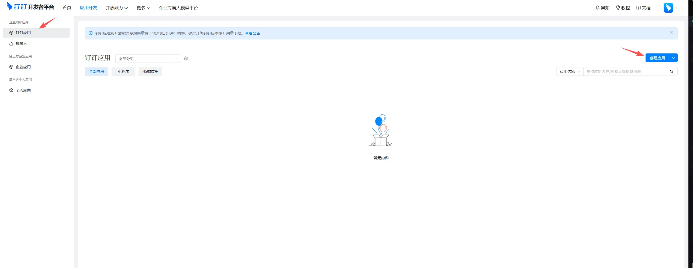
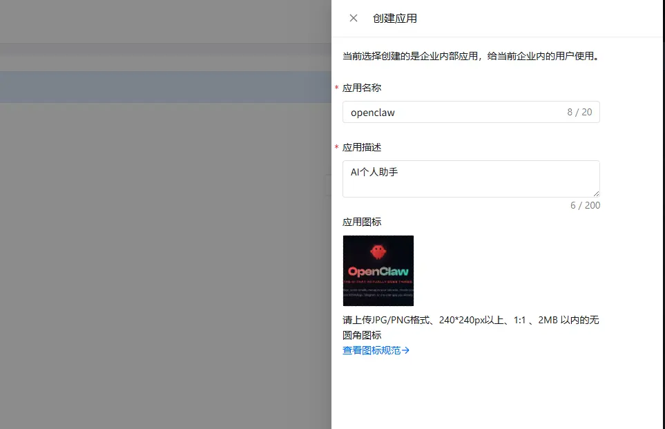
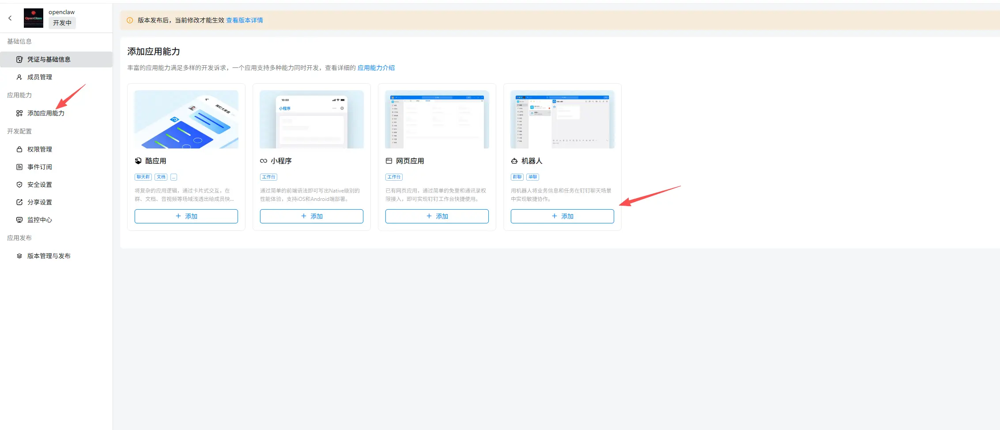
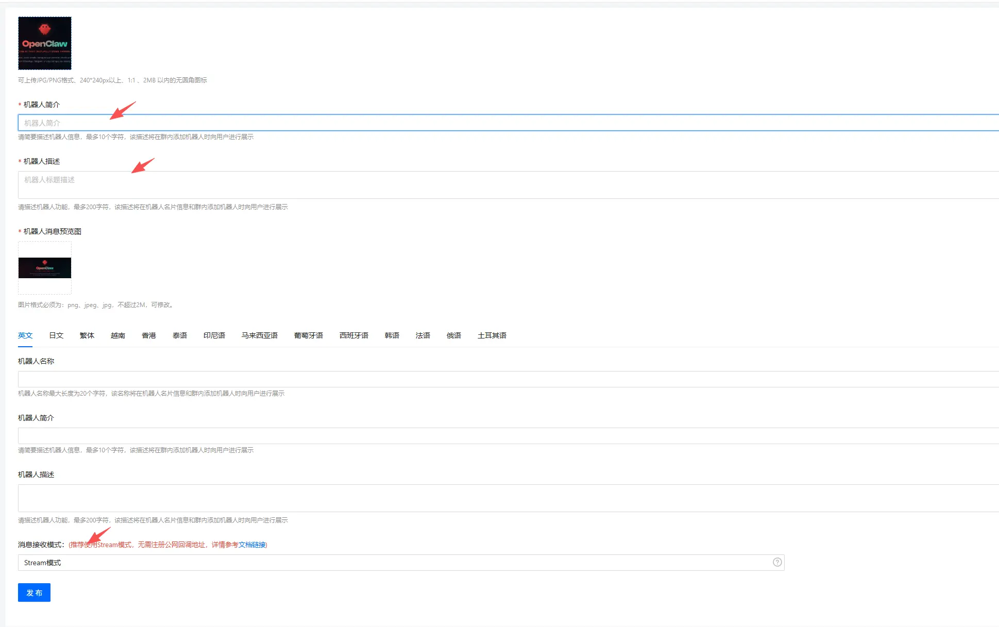
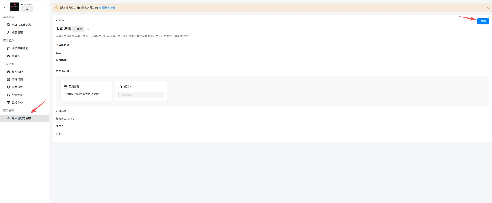
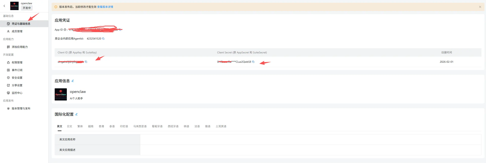
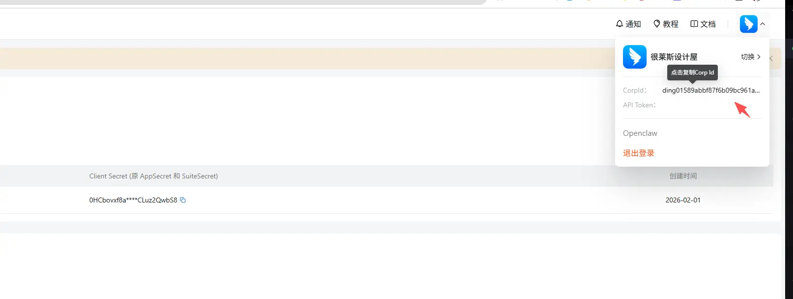
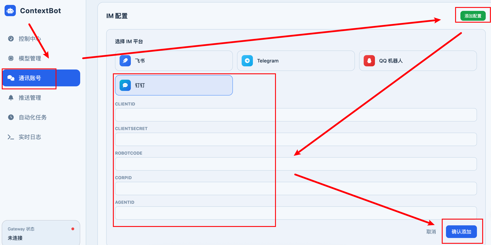
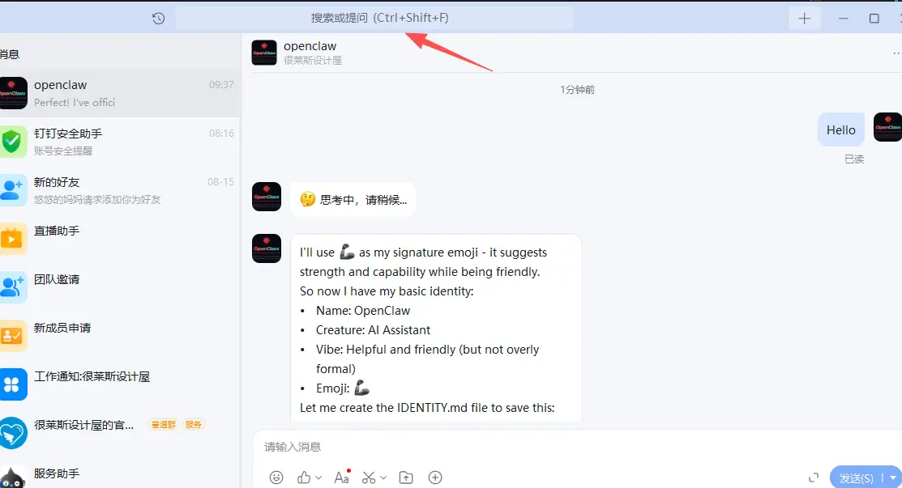

# DingTalk Chat Configuration

Reference: https://catchadmin.com/post/2026-01/openclaw-dingding-install

## Create an Application

Log in to the [DingTalk Open Platform](https://open-dev.dingtalk.com/) and click **Create Application**.

> Note: Creating a DingTalk application requires your DingTalk account to have developer permissions. If you don't have them, contact your organization administrator, or refer to [Obtain Developer Permissions](https://open.dingtalk.com/document/orgapp/obtain-developer-permissions).
>
> Alternatively, you can create your own organization.

In the left navigation bar under **Application Development**, click **DingTalk Applications**, then click **Create Application** in the top-right corner.

Fill in the application name and description, upload an application icon, then save.

### Add a Bot

In the left navigation bar under **Application Development**, click **Add Application Capabilities**, then click **Add Bot**.

After adding the bot, configure some basic information and click **Publish**. Make sure the message receiving mode is set to **Stream Mode**.

### Publish a Version

After publishing the bot, you must also publish a version. In the left navigation bar under **Application Development**, click **Version Management & Release**, then click **Create New Version** in the top-right corner.

### Obtain Credentials

After successfully publishing the version, click **Credentials & Basic Information** in the left menu to obtain the following credentials:

* Client ID (AppKey)
* Client Secret (AppSecret)
* Robot Code (same as Client ID)
* Agent ID (Application ID)

Corp ID (Organization ID):

## Configure Keys

Start the gateway: `python cli/main.py gateway`

Then restart the gateway: `python cli/main.py gateway`

## Chat

Go back to the DingTalk client, search for the bot name (e.g., `openclaw`) in the top search bar:

