# QQ Bot

QQ is a widely-used instant messaging platform that supports text, voice, image, and file communication, as well as group chats and channels for personal and team collaboration.

This integration connects with QQ Bot through the platform's long-connection event subscription mechanism to receive messages and event callbacks, enabling stable and secure message sending/receiving and automation without exposing a public Webhook address.

Reference: https://github.com/sliverp/qqbot/blob/main/README.zh.md

# Setting Up QQ IM Chat

## Configure QQ Bot

### 1. Register on QQ Open Platform

Go to the Tencent QQ Open Platform website. You cannot log in directly with your QQ account by default — you need to register a new QQ Open Platform account.

https://q.qq.com/#/

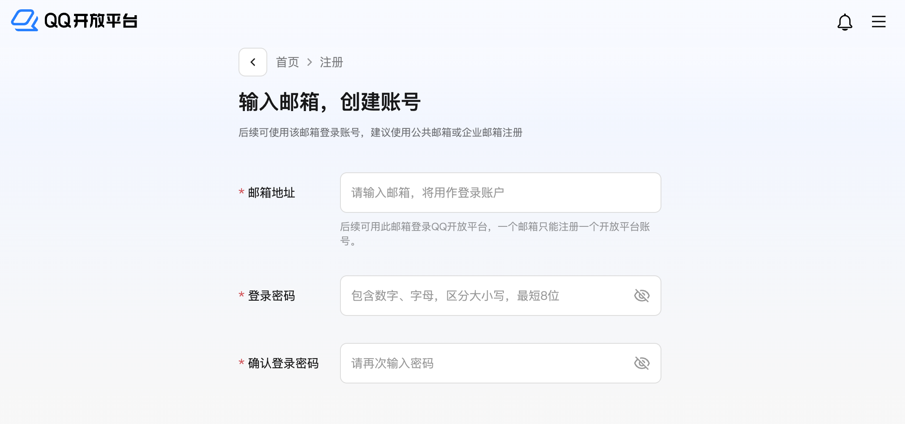

After initial registration, follow the QQ Open Platform guide to set up a super administrator.

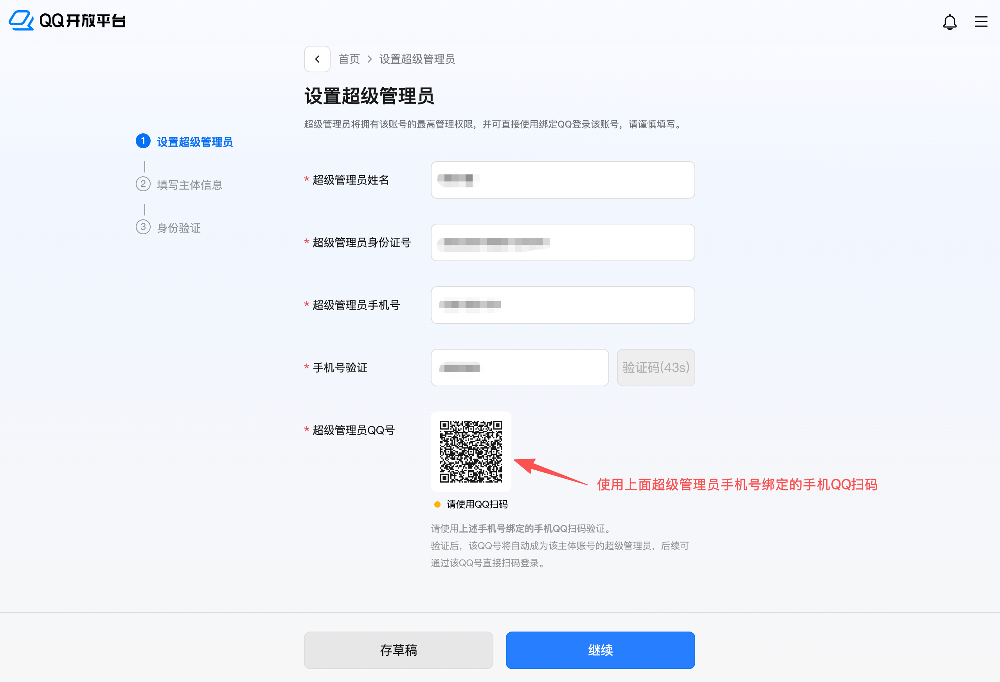

After scanning the QR code with your phone's QQ, proceed to the next step to fill in your identity information.

Here we use "Individual" as an example — follow the guide to enter your name, ID number, phone number, and verification code, then click Continue to proceed to facial recognition.

Use your phone's QQ to scan the QR code for facial recognition.

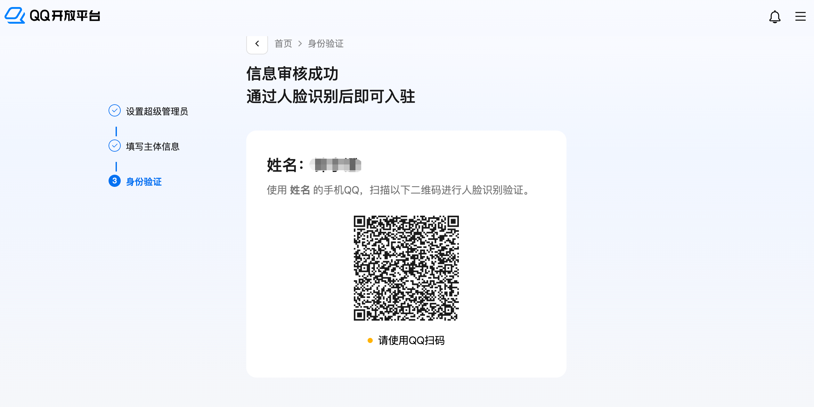

After passing facial recognition, you can log in to the QQ Open Platform.

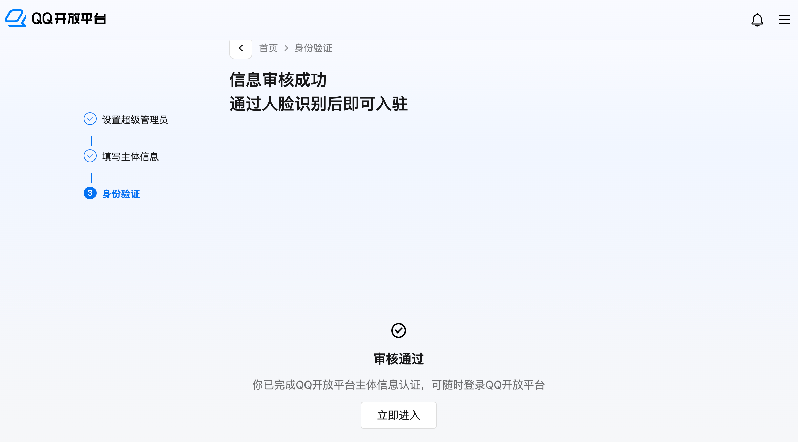

### 2. Create a QQ Bot

On the QQ Bot page of the QQ Open Platform, you can create a bot.

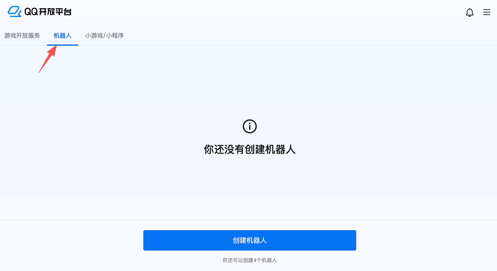
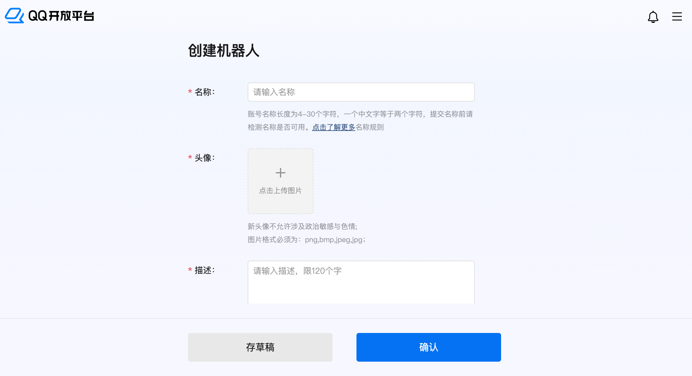

After creating the QQ bot, select the bot and click to enter the management page.

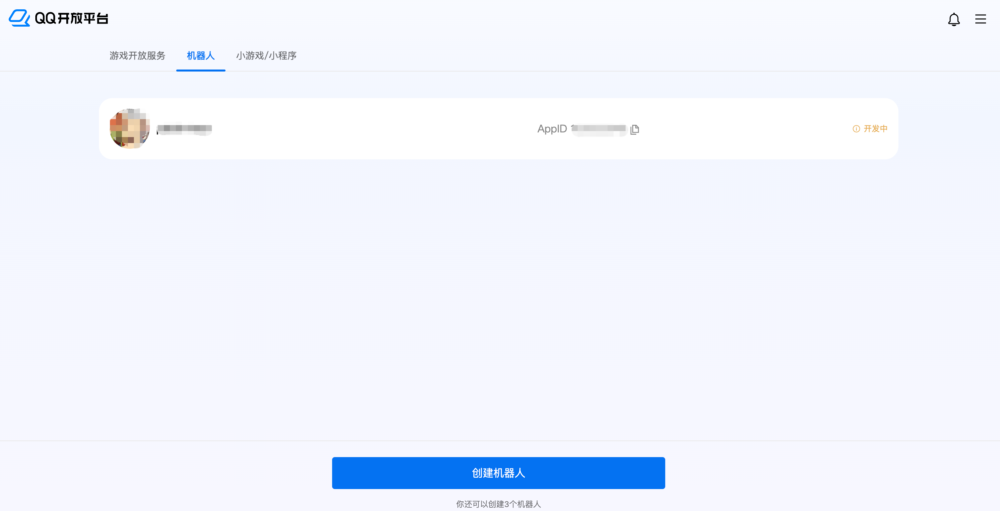

On the QQ bot management page, obtain the bot's **AppID** and **AppSecret**. Copy and save them to a personal notepad or memo (please ensure data security and do not leak them) — they will be needed in "Step 2: Configure OpenClaw".

Note: For security reasons, the QQ bot's AppSecret cannot be stored in plain text. You need to regenerate it if viewing for the first time or if you forget it.

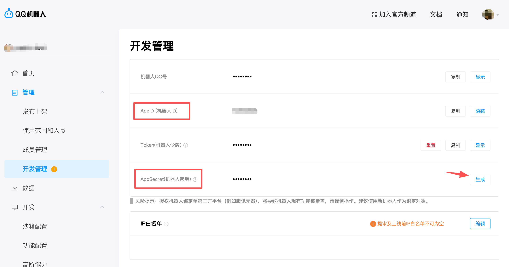
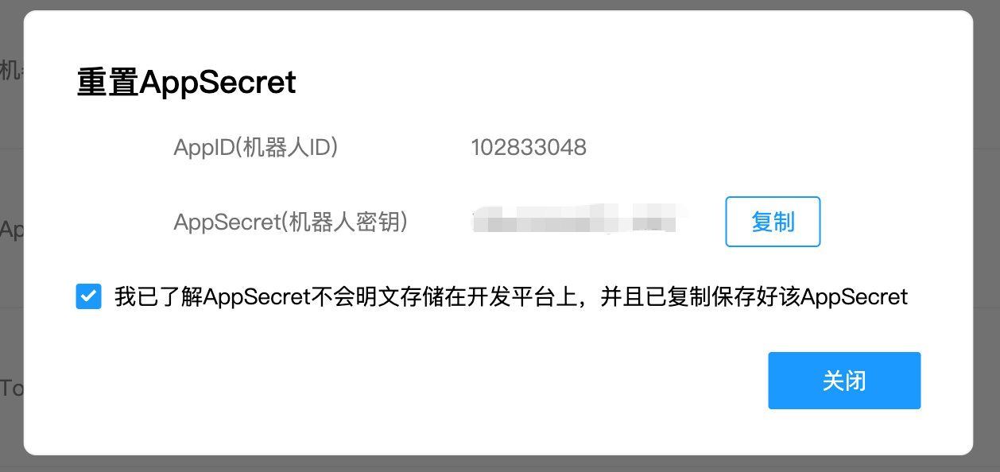

### 3. Sandbox Configuration

On the QQ bot's **Development Management** page, under **Sandbox Configuration**, set up direct chat (select **Configure in Message List**).

You can configure this according to your usage scenario, or complete the subsequent steps first and come back to this step later.

> **Warning:**
> The QQ bot created here does not need to be published publicly for all QQ users. You can use it in the developer's private (sandbox) debugging mode.
> The QQ Open Platform does not support "Configure in QQ Group" — it only supports direct chat with the QQ bot.

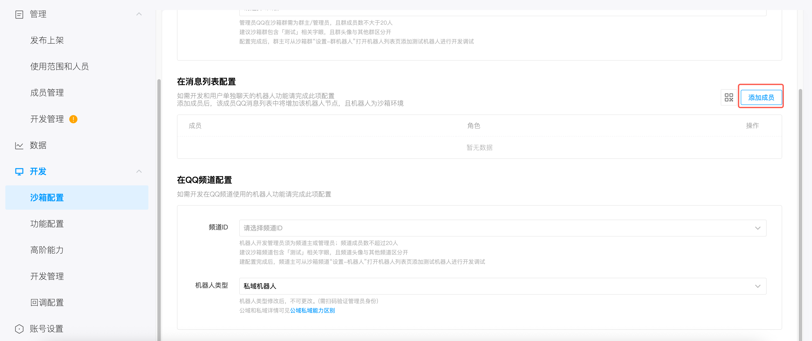

Note: When selecting **Configure in Message List**, you need to add members first, then have those members scan a QR code with their QQ to add the bot.

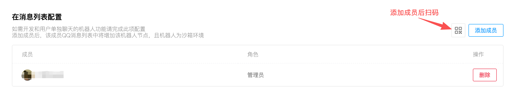

Note that after successfully adding a member, the member still needs to scan a QR code with QQ to add the bot.

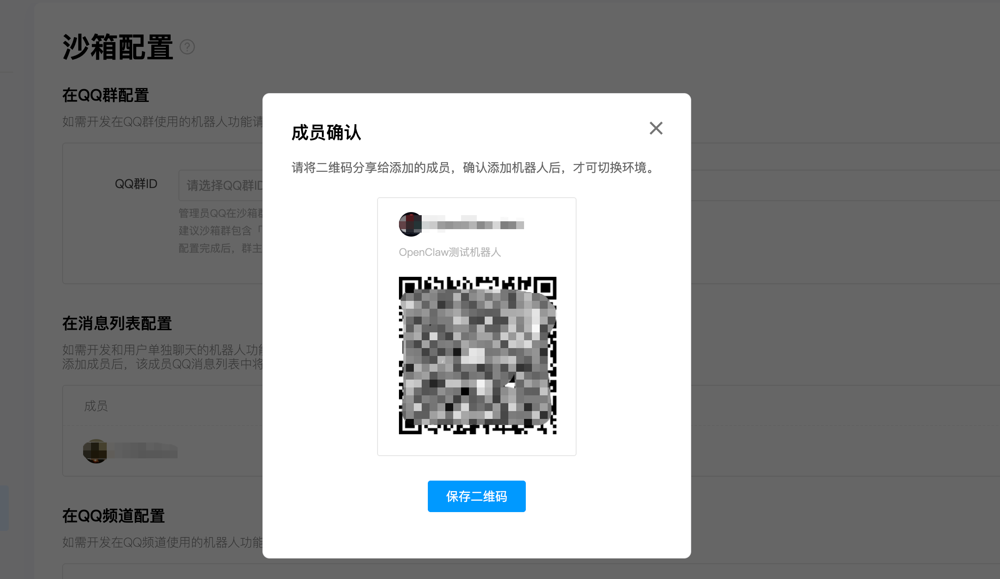

At this point, after adding the bot to your QQ account, you won't be able to chat with it normally — it will show "This bot has gone to Mars, please try again later", because the QQ bot has not yet been connected to the OpenClaw application.

You need to continue with the following steps to configure the QQ bot's AppID and AppSecret for the OpenClaw application.

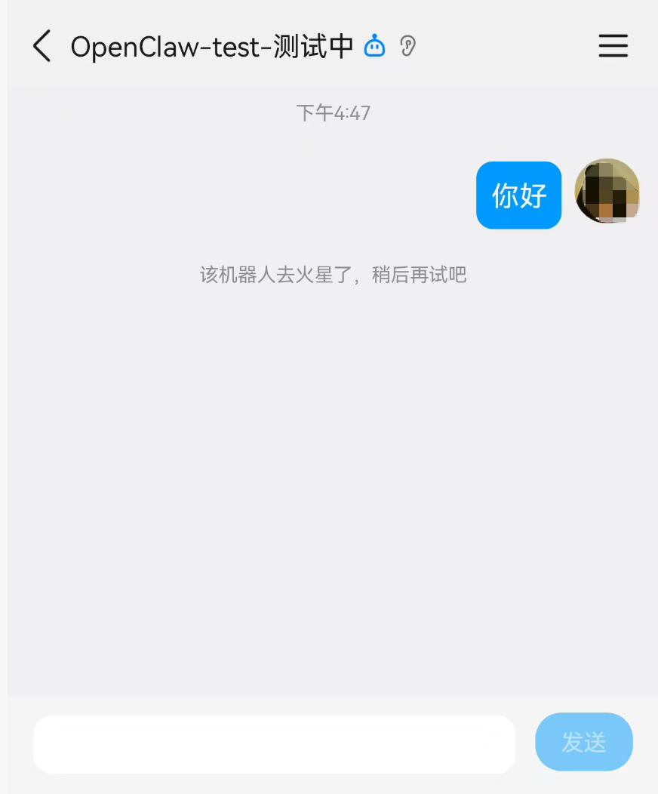

(Optional) You can also add more members by following the previous steps: first add new members on the Member Management page, then add members on the Sandbox Configuration page, and then new members can scan the QR code with QQ to add the bot.

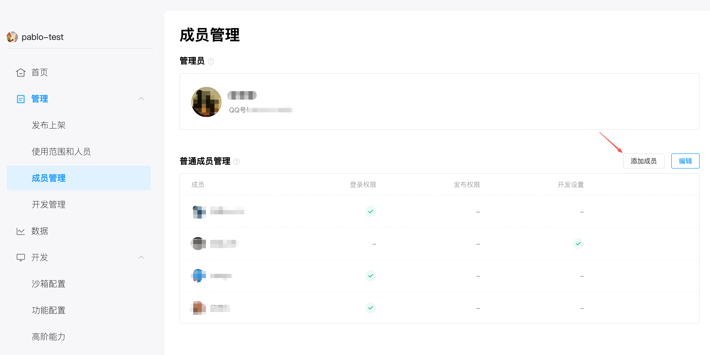
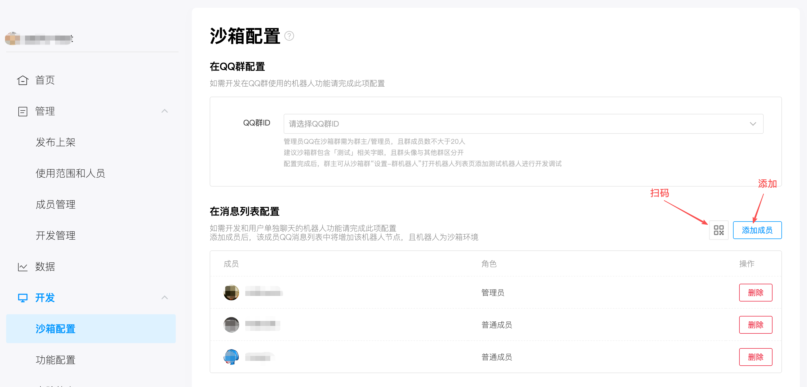
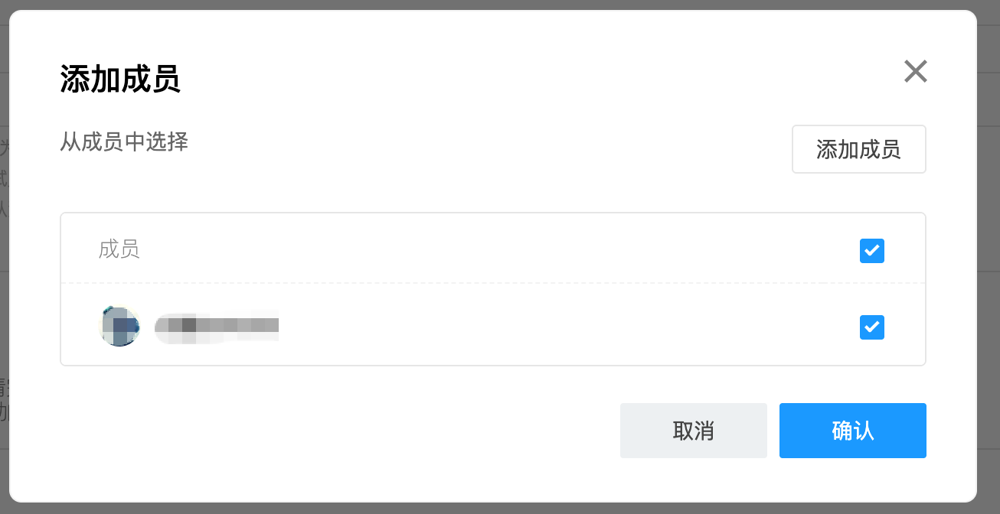

## Step 2: Configure Open-Research-Claw

### Via UI (Recommended)

Start the gateway:

`python cli/main.py gateway`

Click **Communication Accounts** → **Add Configuration** → **QQ Bot**

Add the **AppID** and **AppSecret** obtained in Step 2.

## Step 3: Start and Test

### 1. Restart the gateway

`python cli/main.py gateway`

### 2. Chat with the QQ Bot in QQ

