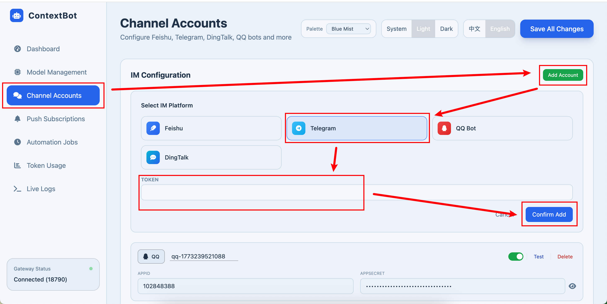

# Telegram Chat Configuration

Please configure the model parameters in the Web UI first.

Reference: https://zhuanlan.zhihu.com/p/2005005876503790436

## Obtain Token

Open Telegram and search for **BotFather**. And open it

Enter `/newbot`, follow the prompts to set the bot **name** and **username**. Once completed, you will receive an **API Token** — make sure to save it, as it will be needed for configuration later.

Search for the Bot username you just created, enter the chat interface, and click **Start**.

If you send a message now (e.g., "hello"), the bot won't reply yet.

## Configure Token in Web UI

Start the gateway: `python cli/main.py gateway`

Enter the Telegram token:

Then restart the gateway.

Now the bot will reply to your messages:

