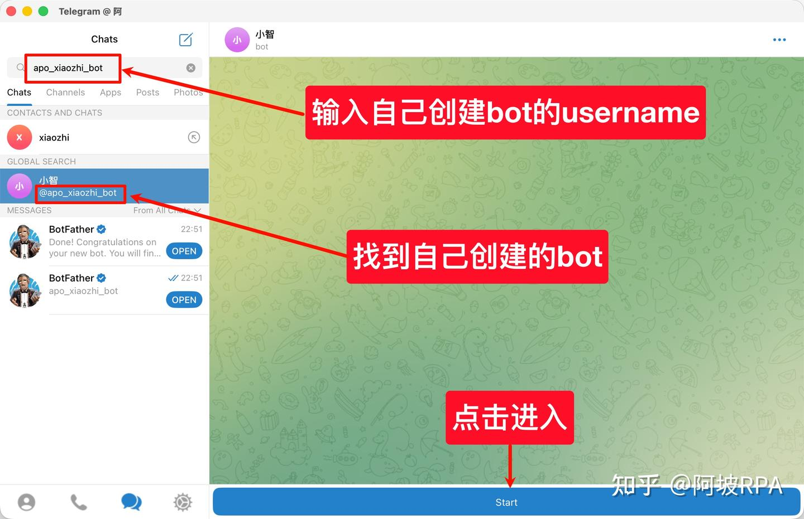
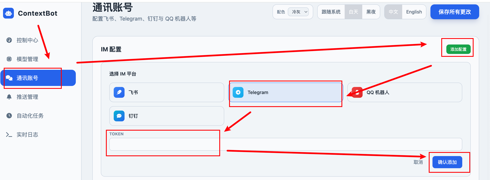
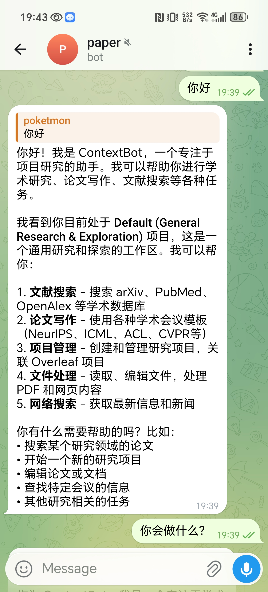

# Telegram 聊天配置

请先在web ui配置好模型参数

参考：https://zhuanlan.zhihu.com/p/2005005876503790436

## 获取Token

打开telegram，搜索BotFather

输入 /newbot，按提示设置机器人名称和用户名，完成后会收到一个 API Token，请务必保存好，后面配置时需要用到。

搜索你刚创建的 Bot 用户名，进入聊天界面，点击 Start。

现在输入 你好，还不会回复消息

## web ui配置token

启动gateway `python cli/main.py gateway`

填入telegram的token

然后重启gateway

再发送消息就能回复了

