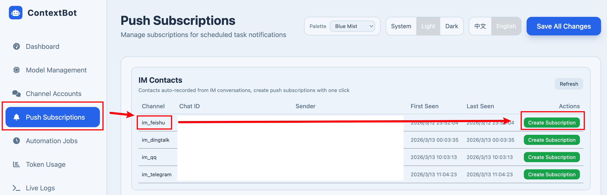
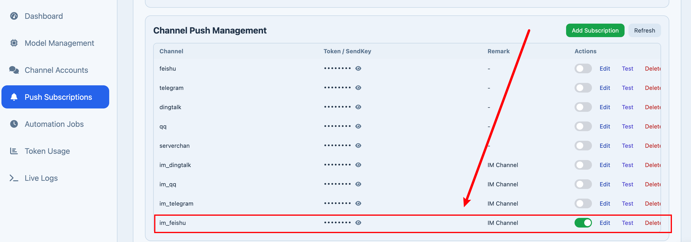
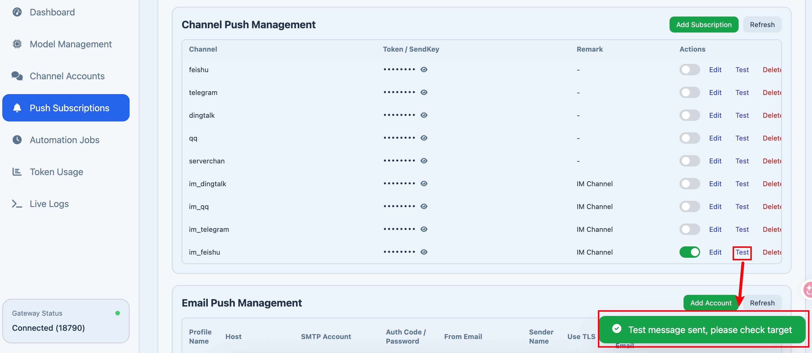

# 添加推送订阅

## 方式1: 根据配置的im添加推送订阅-可聊天

该添加方式可以让聊天的bot推送订阅信息，用可以基于推送继续交流

不同im的添加流程是一样的，以Feishu为例

配置的前提条件：

- 配置好Feishu Bot
- 配置好LLM Model

启动 python cli/main.py gateway

访问web ui：http://127.0.0.1:18790/ui/

在Feishu给Bot发送一条消息

在web ui 的推送订阅中就可以看到 Feishu的渠道，点击添加订阅

就添加了im 推送订阅

点击测试，可以在feishu里面收到推送消息，即代表成功

在自动化任务中，选择好项目

（如果没有，可以在im中对话，让bot创建一个项目）

勾选上im_feishu，就可以进行消息推送了（自动化任务执行完成就会推送消息）

## 方式2: 推送订阅-仅用于推送

本方式类似邮件推送，仅用于推送信息，无法基于推送信息继续交流。

相比于方式1，本方式需额外配置其他bot或者邮箱，步骤较多，适合只想接收推送的用户

- [飞书推送配置](notifaction_feishu_ZH.md)
- [Telegram推送配置](notifaction_Telegram_ZH.md)
- [QQ推送配置](notifaction_QQBot_ZH.md)
- [钉钉推送配置](notifaction_DingTalk_ZH.md)
- [邮箱推送配置](notifaction_email_ZH.md)