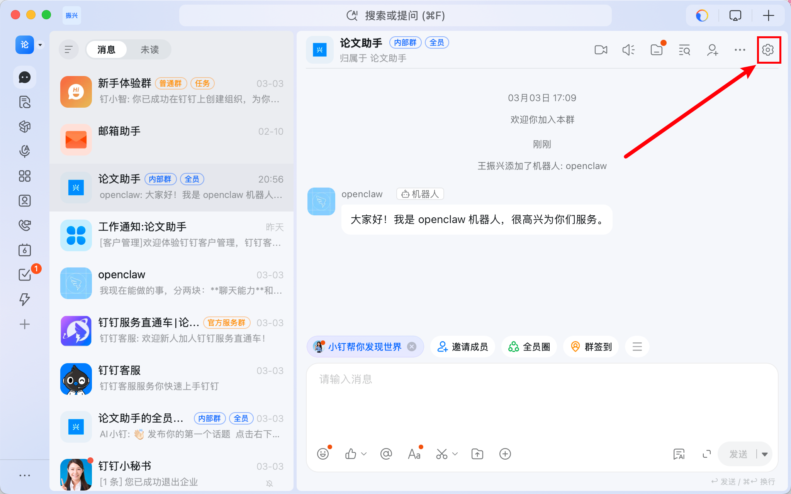
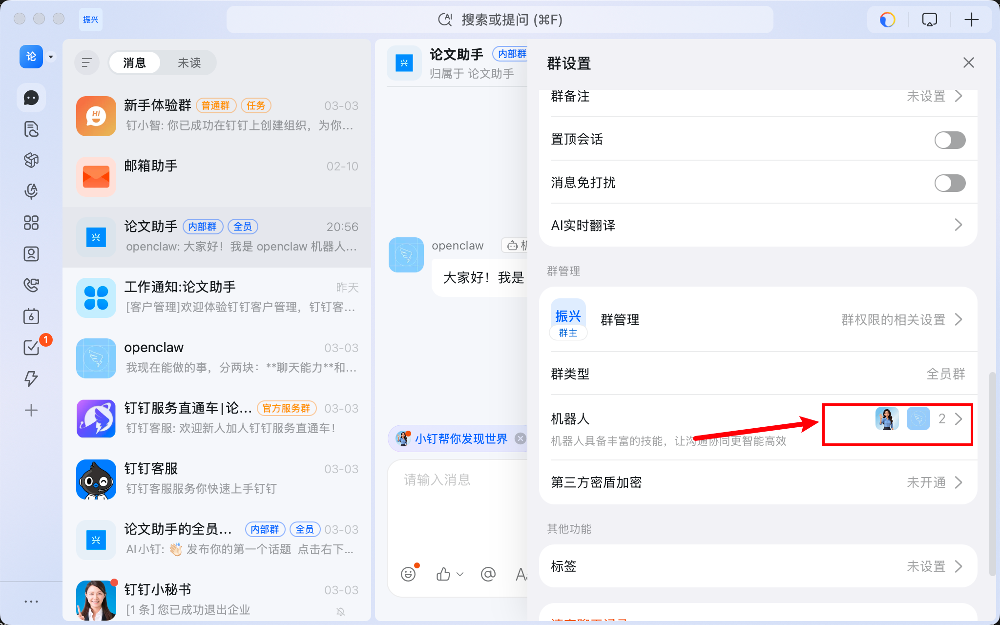
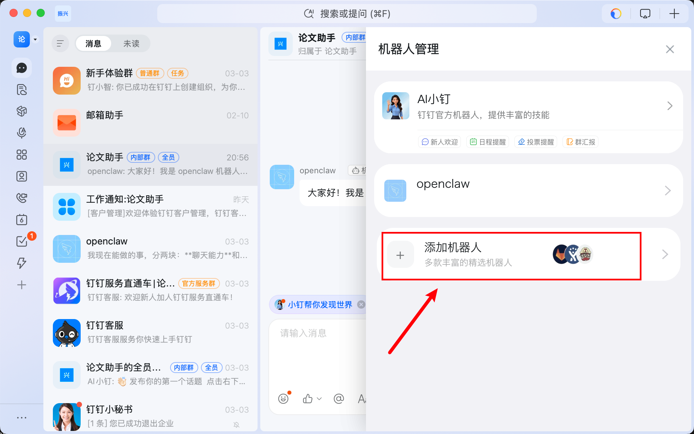
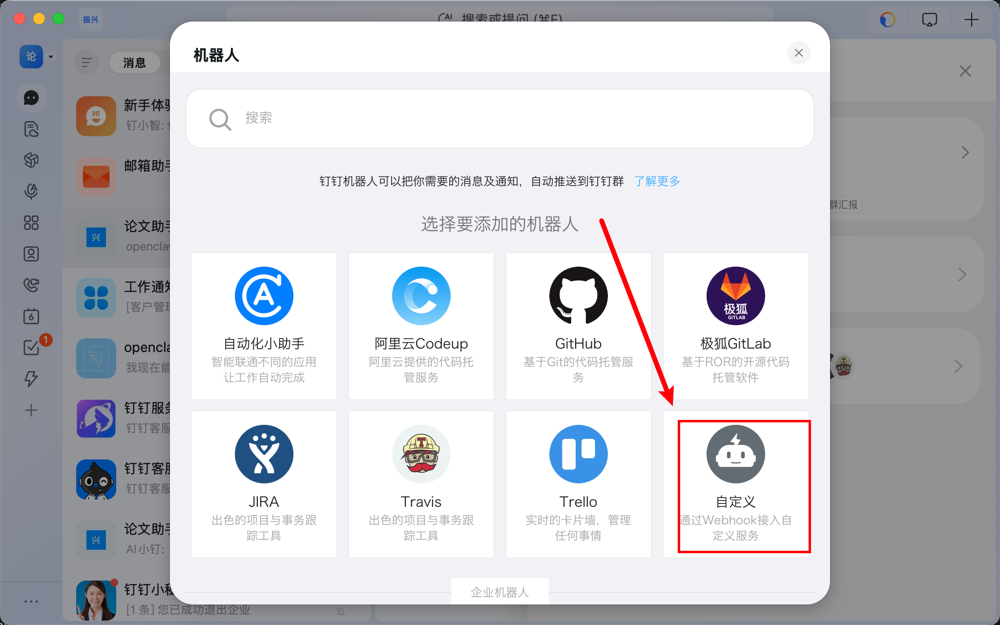
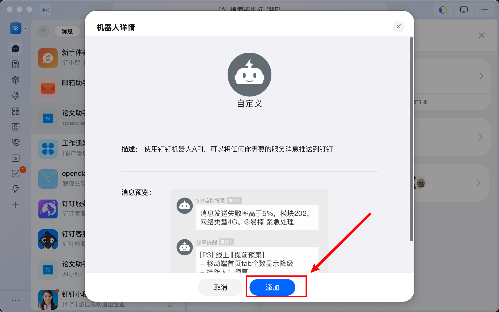
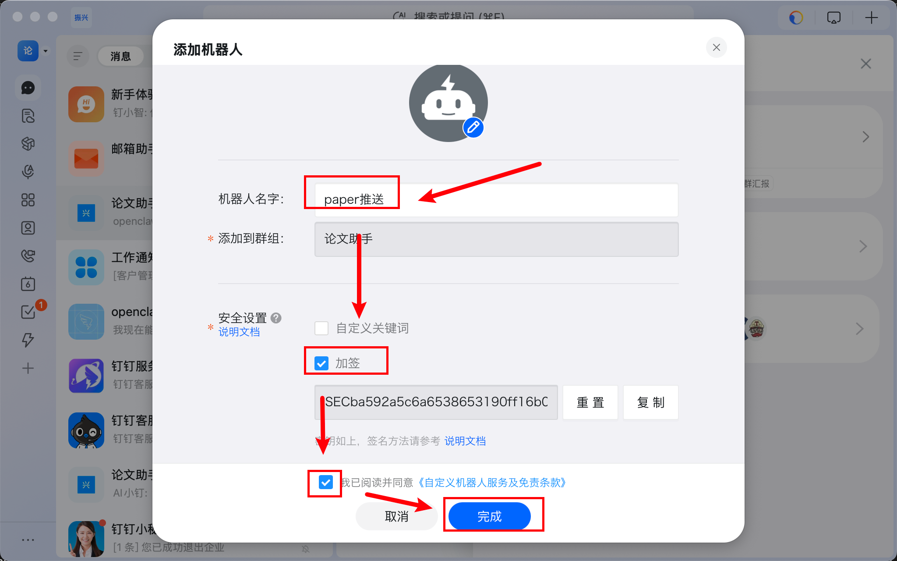
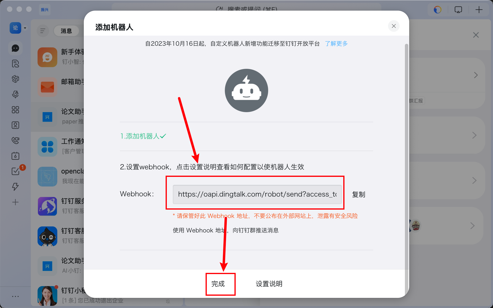
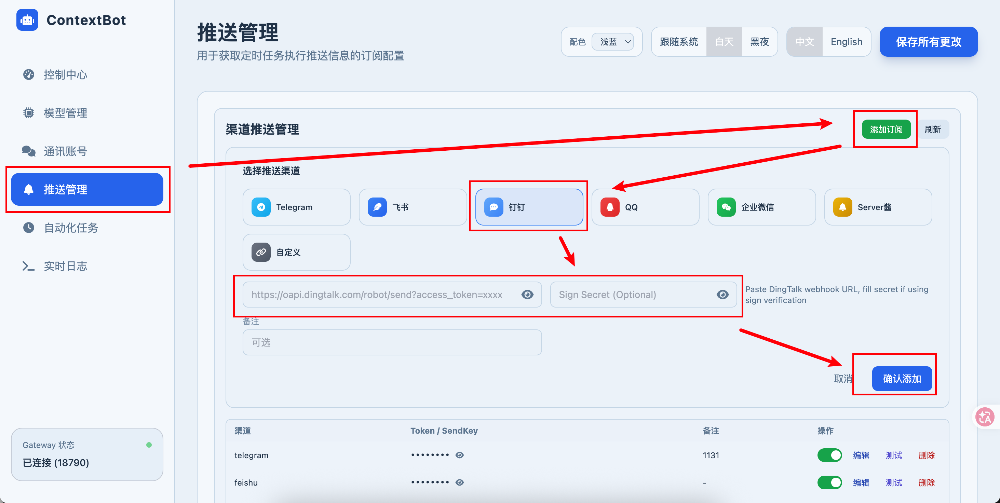
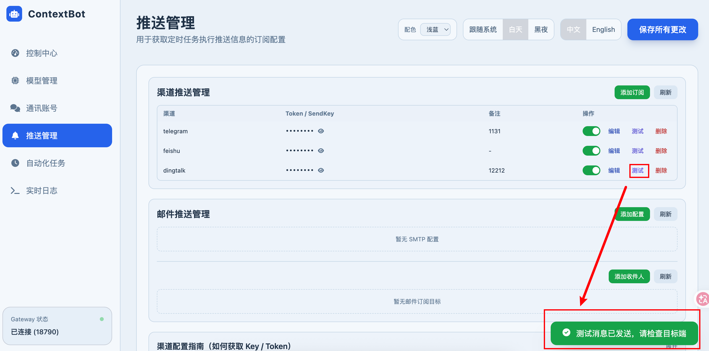
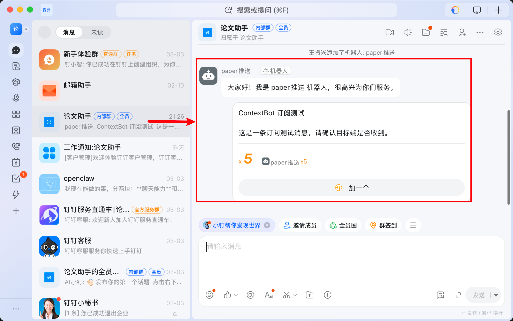

# 推送订阅配置

### 1. 在群组中添加机器人

在钉钉群聊中，点击右上角的群设置按钮，点击→「机器人」





### 2. 添加自定义机器人

点击「添加机器人」



点击自定义



点击添加



起个名字-> 安全设置选加签 -> 同意条款 -> 点击完成

记得复制 加签



复制webhook，然后点击完成



## WebUI 添加配置

### 1. 启动 WebUI

```bash
python cli/main.py gateway
```

### 2. 访问配置页面

访问 `http://127.0.0.1:18790/ui/`，点击「推送管理」标签页

点击「添加订阅」按钮，在渠道选择中点击「钉钉」

- 直接粘贴从钉钉复制的完整 webhook 地址
- 例如：`https://oapi.dingtalk.com/robot/send?access_token=你的token`
- 粘贴加签密钥
- 填写备注信息，方便识别不同的推送配置
- 例如：开发群通知、生产环境告警等
  

### 5. 测试推送

点击「测试」按钮，如果配置正确：

- 界面会显示「已发送」
  
- 钉钉群聊中会收到测试消息
  

  如果测试失败，请检查：
- Webhook 地址是否正确
- 如果设置了关键词，测试消息中是否包含该关键词
- 机器人是否被移除或禁用

### 6. 启用推送

测试成功后，确保订阅状态为「已启用」，这样定时任务执行时就会自动推送通知到钉钉群

## 注意事项

### 频率限制

钉钉机器人有以下限制：

- 每个机器人每分钟最多发送 20 条消息
- 超过限制会返回错误，消息发送失败
- 建议合理设置定时任务的执行频率

### 错误处理

常见错误及解决方法：

| 错误信息                    | 原因               | 解决方法                                 |
| --------------------------- | ------------------ | ---------------------------------------- |
| `keywords not in content` | 消息中不包含关键词 | 检查安全设置中的关键词，确保消息包含该词 |
| `invalid token`           | Token 错误或已失效 | 重新获取 webhook 地址                    |
| `sign not match`          | 签名验证失败       | 改用关键词验证方式                       |
| `request limit`           | 超过频率限制       | 降低推送频率，等待一分钟后重试           |

## 常见问题

### Q1: 收不到推送消息

**可能原因**：

- Webhook 地址错误
- 机器人被移除或禁用
- 超过频率限制
- 网络连接问题
- 加签密钥错误（如使用加签方式）

**排查步骤**：

1. 在 WebUI 中点击「测试」按钮，查看返回的错误信息
2. 检查钉钉群中机器人是否还在
3. 检查是否在短时间内发送了大量消息
4. 如使用加签，确认密钥是否正确
5. 查看服务器日志，确认是否有网络错误

### Q2: 如何在多个群中推送

**方法**：为每个群创建独立的机器人和推送配置

1. 在每个钉钉群中分别添加自定义机器人
2. 获取每个机器人的 webhook 地址
3. 在 WebUI 中添加多个推送订阅，每个对应一个群
4. 使用备注字段区分不同的群
