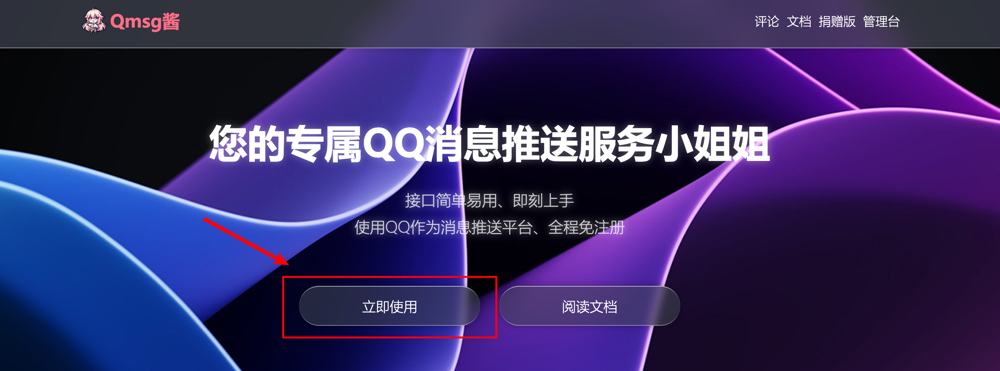
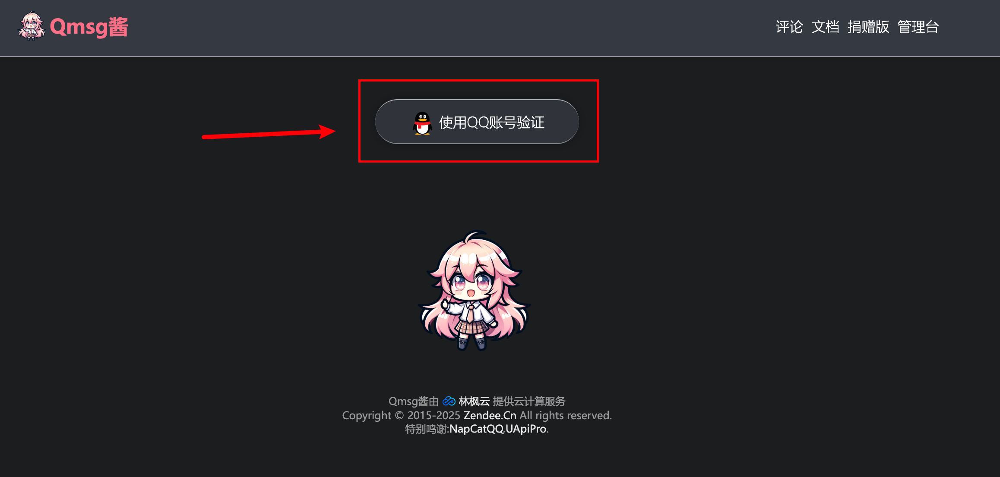
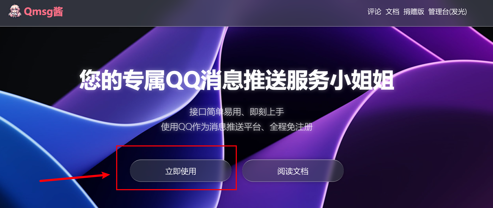
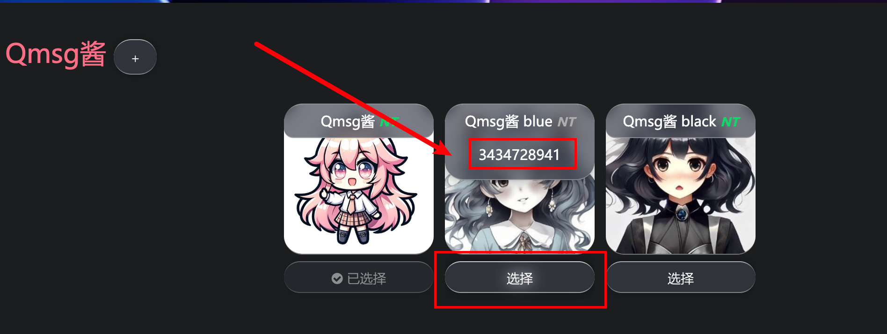
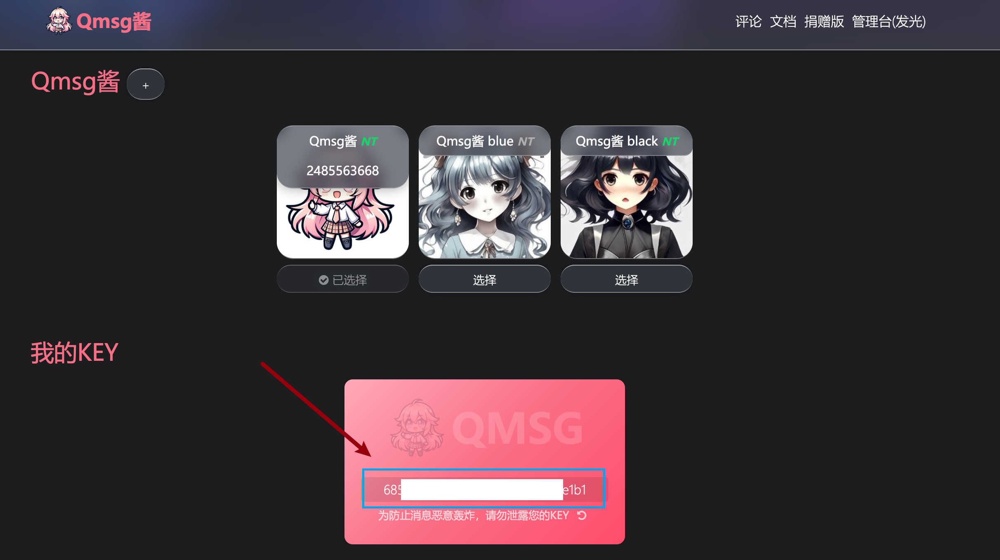
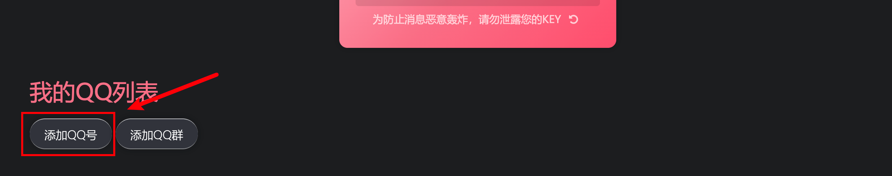
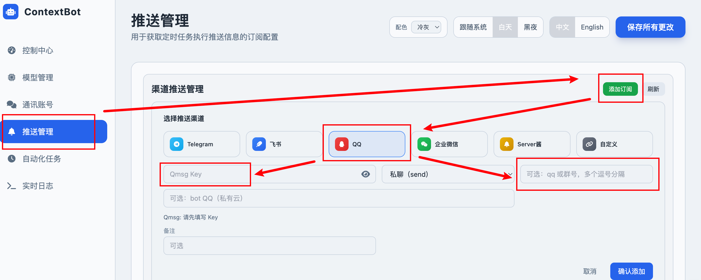

# QQ Push Configuration

## Register a Push Account

Visit https://qmsg.zendee.cn/ and click "Get Started".

Log in with your QQ account.

After logging in, click "Get Started" again.

Click to select a bot, and add the bot as a friend on QQ.

If you can't add one, try another.

Copy the key — you will need it later for the gateway configuration.

Click "QQ Number" and enter your own QQ number.

## Configure in WebUI

Start the gateway: `python cli/main.py gateway`

Visit `http://127.0.0.1:18790/ui/`

Enter the copied Key and your QQ number (this QQ number must have the bot added as a friend and be included in the QQ list above).

After adding, click "Test".

Restart the gateway, and you will start receiving subscriptions via QQ.
