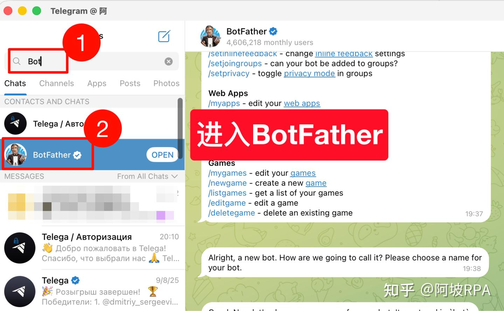
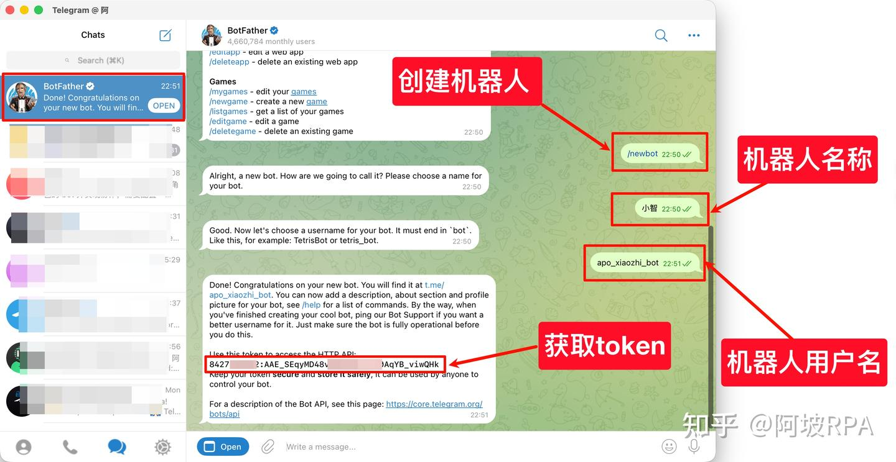
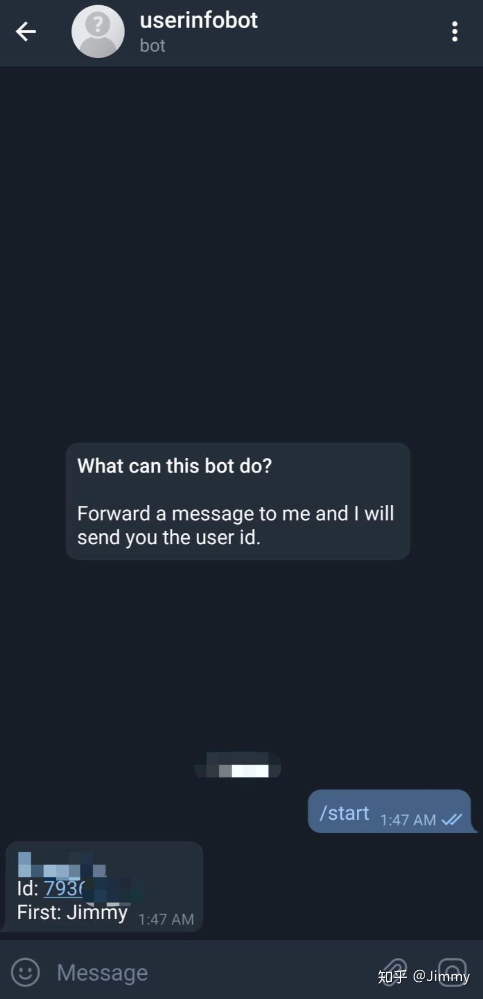
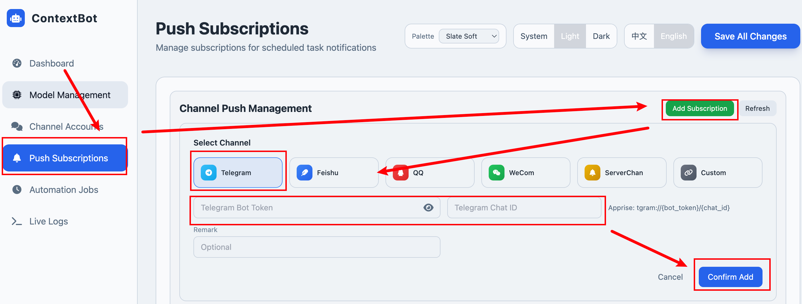
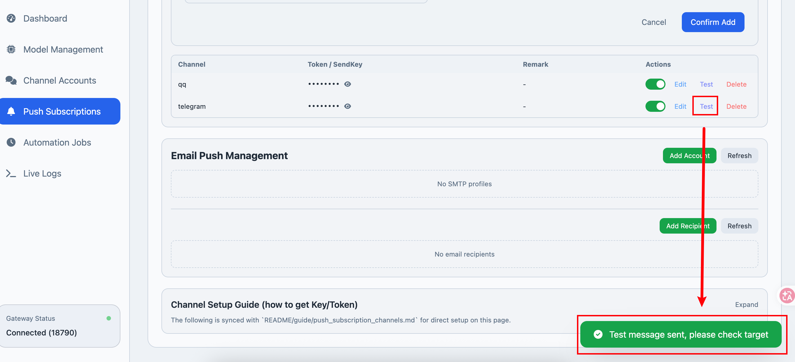

# Telegram Push Configuration

## Obtain a Token

If you want a dedicated push channel, you can create a new bot specifically for push notifications.

Open Telegram and search for **BotFather**.

Send `/newbot`, follow the prompts to set the bot name and username. Once completed, you will receive an API Token — make sure to save it, as it will be needed for configuration.

## Obtain Your Chat ID

Add **userinfobot** to get your ID. Send `@userinfobot` in any chat window.

Then click on the message to open a chat with **userinfobot**.

Send any message to **userinfobot** and it will return your information.

This includes an ID — that is the **chat_id** we need.

## Enter the Token and Chat ID in WebUI

Start the gateway: `python cli/main.py gateway`

Enter the Token and Chat ID, then save.

Click "Test" — it will show that the message has been sent.

Receiving a message in Telegram confirms the configuration is successful.

