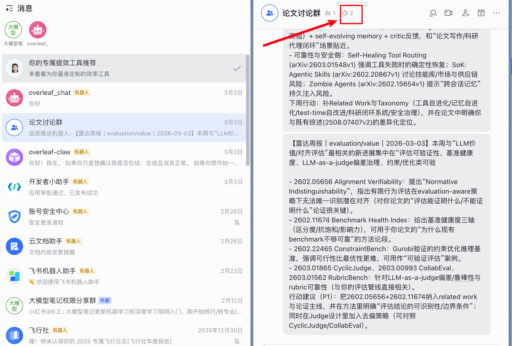
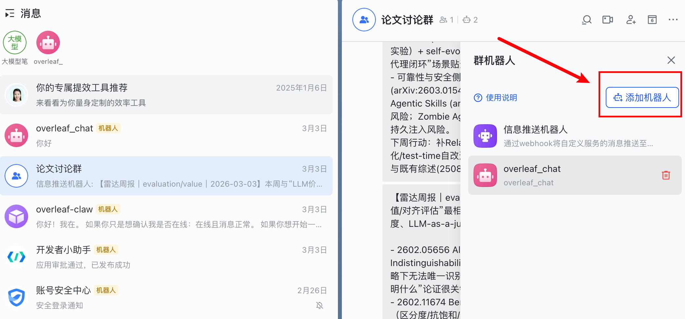
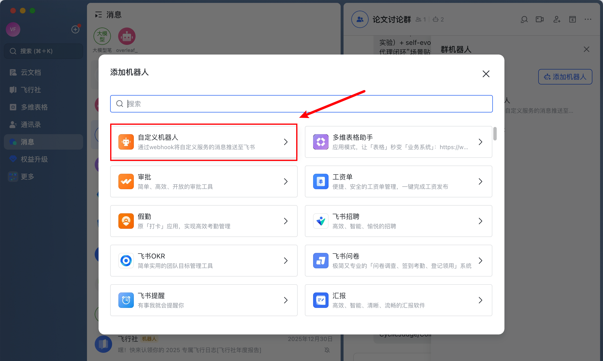
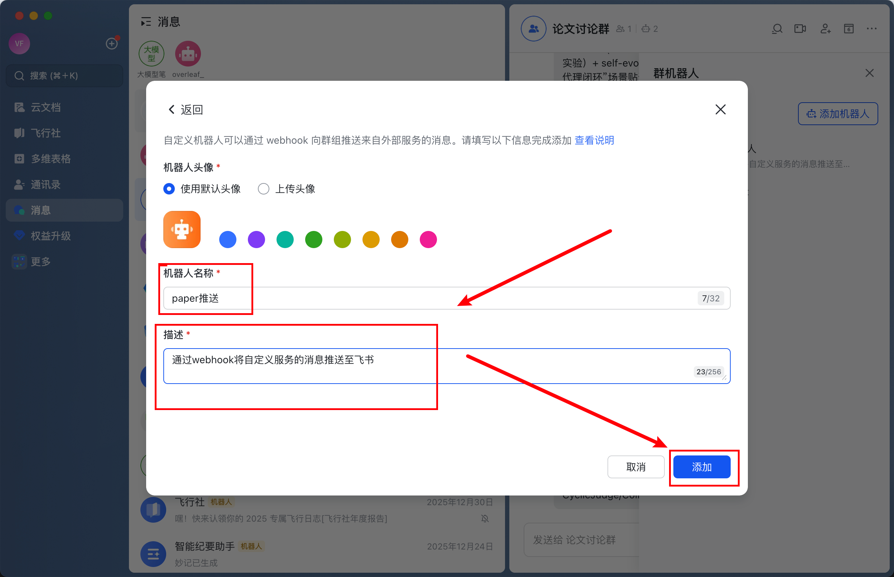
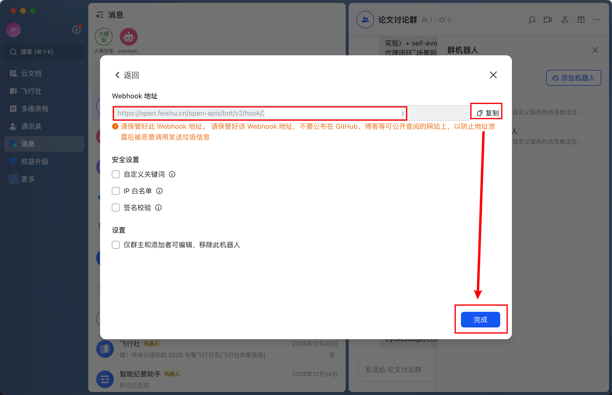
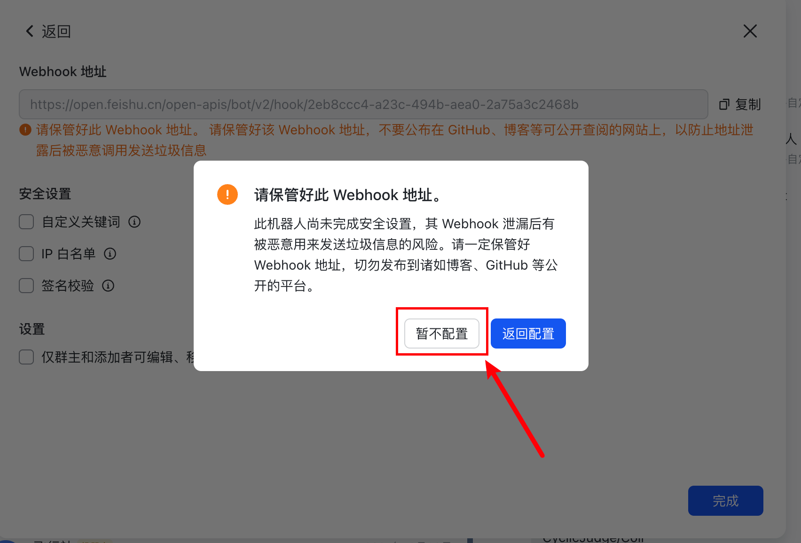
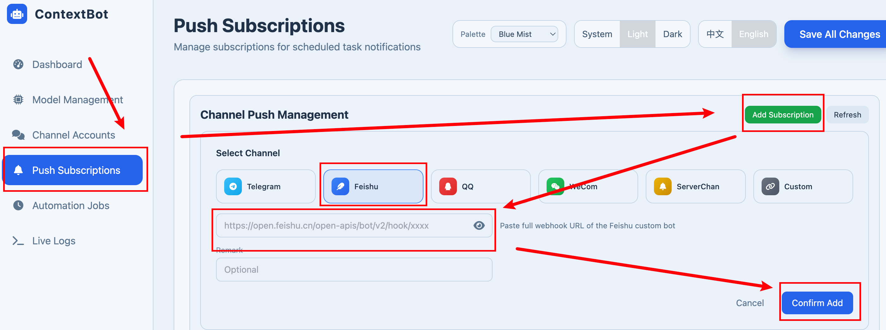
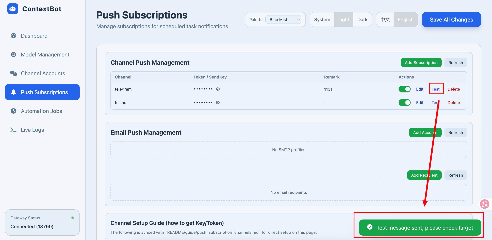
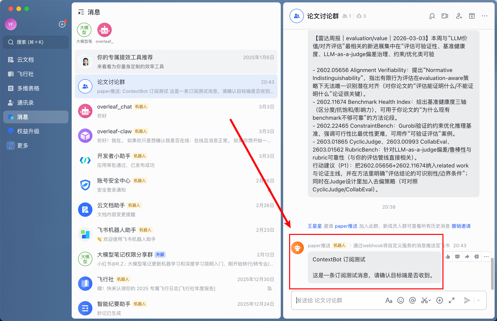

# Feishu Push Configuration

## Create a Push Bot

In a group chat, click here to view bots (if you don't have a group, you can create one yourself).

Click "Add Robot".

Click "Custom Robot".

Fill in the information in these two fields.

Copy the webhook URL and click "Finish".

Click "Skip for now".

## WebUI Configuration

Start the WebUI: `python cli/main.py gateway`

Visit the WebUI at `http://127.0.0.1:18790/ui/` and add the webhook.

Click "Test" — it will show "Sent".

Receiving a push notification in Feishu means the configuration is successful.

