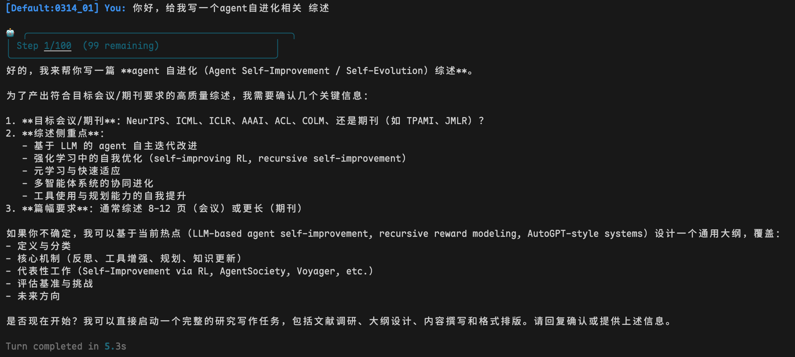
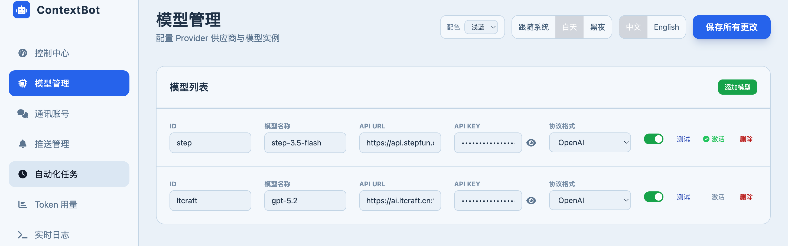
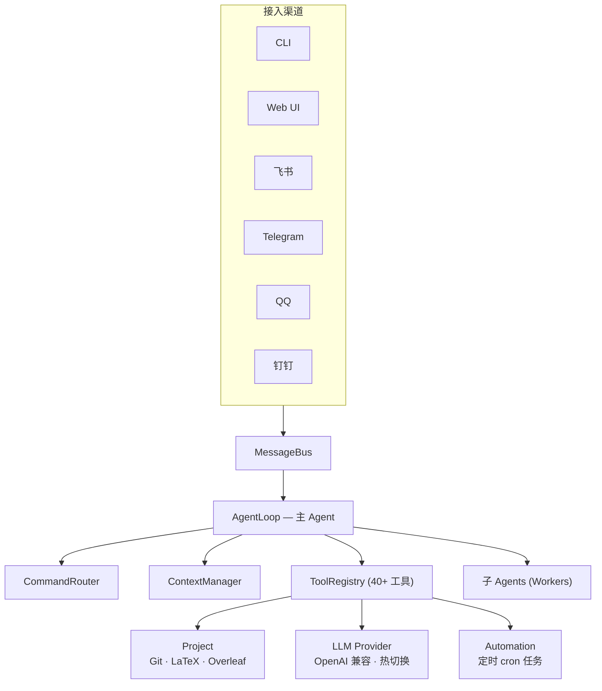
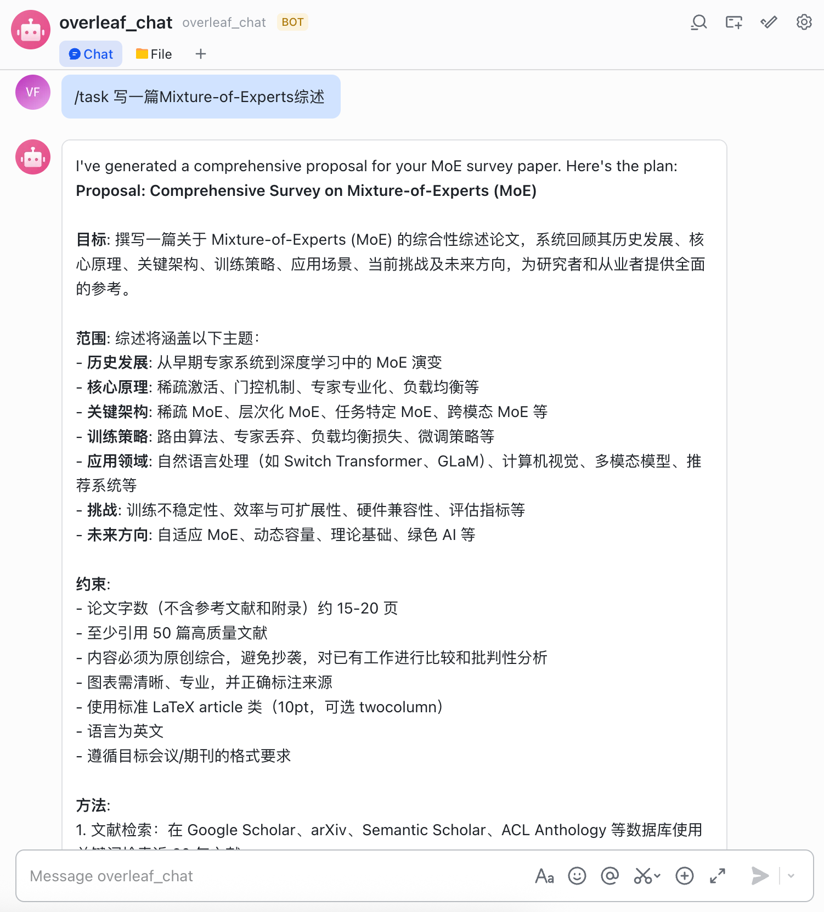
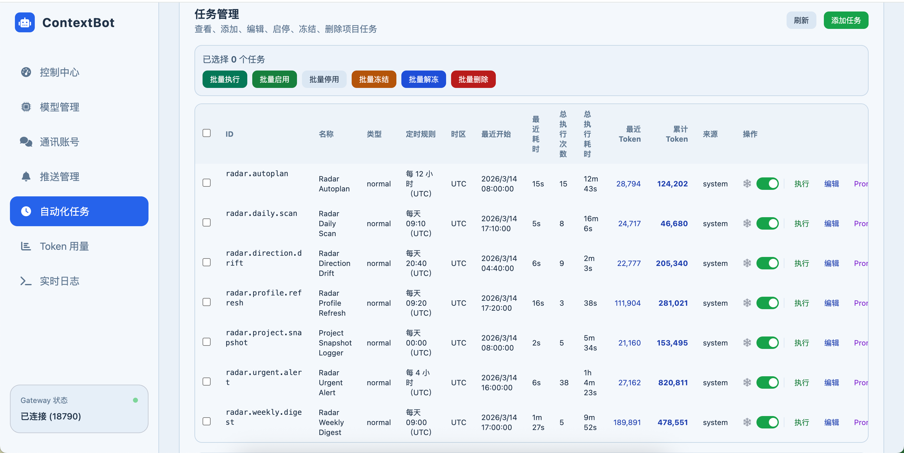

<div align="center">

<picture>
  <source media="(prefers-color-scheme: dark)" srcset="README/images/logo-dark.svg">
  <source media="(prefers-color-scheme: light)" srcset="README/images/logo.svg">
  
</picture>

<br><br>

**你自己的 AI 学术研究助手 — 管理论文、检索文献、追踪截稿日期，在你常用的渠道随时响应。**

[](https://www.python.org/downloads/)
[](LICENSE)
[-blue)](#快速开始)
[](https://github.com/nanoAgentTeam/research-claw/pulls)

**[English](README.md)** &nbsp;|&nbsp; **[中文](README_zh.md)**

<br>

https://github.com/user-attachments/assets/9280d4dc-c666-4688-84b7-d9534ab0e979

<sub>真实用户演示 &middot; 移动端 &middot; 由 GLM-5 驱动<br>
产出论文：<a href="https://nanoagentteam.github.io/assets/Agent_survey.pdf">LLM-Based Autonomous Agents Survey</a> &middot; <a href="https://nanoagentteam.github.io/assets/toolCLIP.pdf">ToolCLIP</a></sub>

</div>

---

## 目录

- [Research Claw 是什么？](#research-claw-是什么)
- [核心功能](#核心功能)
- [快速开始](#快速开始)
- [工作原理](#工作原理)
- [配置参考](#配置参考)
- [文档](#文档)
- [参与贡献](#参与贡献)
- [许可证](#许可证)

## Research Claw 是什么？

Research Claw 是一个运行在你自己机器上的 AI 学术研究助手。它管理你的 LaTeX 论文项目，同步 Overleaf，检索文献，追踪截稿日期——并在你常用的渠道随时响应（CLI、Web UI、Telegram、飞书、QQ、钉钉）。

不再需要在编辑器、Overleaf、终端和搜索引擎之间来回切换：

```
You: 创建一个叫 "MoE-Survey" 的论文项目，并关联 Overleaf
Bot: ✅ 项目已创建，Overleaf 已关联，已切换到 MoE-Survey。

You: 调研最新的 MoE 论文并写一个 Introduction
Bot: 🔎 搜索 arXiv... 📝 撰写 Introduction... ✅ 编译通过。

You: /sync push
Bot: ✅ 已推送 3 个文件到 Overleaf。
```

<p align="center">
  
  <br><em>交互式 CLI 会话</em>
</p>

## 核心功能

<table>
<tr>
<td width="50%" valign="top">

### :writing_hand: 写作与编译
- 通过对话读写和重构 `.tex` / `.bib` 文件
- 一键 LaTeX 编译，自动诊断并修复错误
- 内置 NeurIPS、ICML、ICLR、AAAI、ACL、CVPR 等会议模板

</td>
<td width="50%" valign="top">

### :arrows_counterclockwise: Overleaf 与 Git
- Overleaf 双向同步 — 拉取编辑、推送变更，无需浏览器
- 每次 AI 编辑自动 Git 提交 — 几秒内回滚任何变更
- 交互式 `/git` 模式，查看历史、对比差异、一键回退

</td>
</tr>
<tr>
<td width="50%" valign="top">

### :busts_in_silhouette: 多 Agent 协作
- 将调研、写作、审阅委派给专门的子 Agent
- 子 Agent 在隔离沙箱中工作 — 不会意外覆盖文件
- `/task` 模式将复杂目标分解为 DAG 并行执行

</td>
<td width="50%" valign="top">

### :mag: 文献检索
- 集成 arXiv、PubMed、OpenAlex
- 支持 PDF 全文阅读和深度分析

</td>
</tr>
<tr>
<td width="50%" valign="top">

### :satellite: 研究雷达与自动化
- 定时任务自动追踪研究领域 — 新论文、热点趋势、截稿提醒
- 每日扫描、周报汇总、方向漂移检测 — 全部无人值守
- 推送到 Telegram、飞书、钉钉、邮件或任何 Apprise 渠道

</td>
<td width="50%" valign="top">

### :brain: 记忆与上下文
- 项目级记忆 — 跨 Session 记住研究方向、偏好和先前工作
- 自动上下文摘要，在 token 限制内不丢失关键信息
- 记忆驱动的自动化 — 定时任务读写项目记忆，保持连续性

</td>
</tr>
<tr>
<td colspan="2" align="center">

### :globe_with_meridians: 随时随地访问
**Web UI** &nbsp;&bull;&nbsp; **CLI** &nbsp;&bull;&nbsp; **飞书** &nbsp;&bull;&nbsp; **Telegram** &nbsp;&bull;&nbsp; **QQ** &nbsp;&bull;&nbsp; **钉钉** — 无需公网 IP

</td>
</tr>
</table>

<details>
<summary><strong>功能概览（视频）</strong></summary>
<br>

https://github.com/user-attachments/assets/fccb837c-cfc5-4063-b803-2ae900fb4a20

</details>

## 快速开始

### 1. 安装

**Linux / macOS：**

```bash
git clone https://github.com/nanoAgentTeam/research-claw.git
cd research-claw

python3 -m venv .venv
source .venv/bin/activate
pip install -r requirements.txt
```

<details>
<summary><strong>Windows 用户（通过 WSL）</strong></summary>

Research Claw 依赖 POSIX 特性（信号处理、进程管理等），不支持在原生 Windows 上直接运行。推荐通过 **WSL2**（Windows Subsystem for Linux）来运行 — WSL2 内置真正的 Linux 内核，网络、文件系统、进程管理均为原生 Linux 行为，无需修改任何代码。

**第一步：安装 WSL2**

在 PowerShell（管理员）中运行：

获取可下载的列表: `wsl --list --online`

```
NAME            FRIENDLY NAME
Ubuntu          Ubuntu
Ubuntu-18.04    Ubuntu 18.04 LTS
Ubuntu-20.04    Ubuntu 20.04 LTS
```
选择一个版本进行下载
```powershell
wsl --install -d Ubuntu-20.04
```

安装完成后重启电脑，首次启动会提示设置用户名和密码。

**第二步：安装 Python 3.11**

```bash
sudo apt update && sudo apt install -y python3.11 python3.11-venv python3-pip git
```

**第三步：克隆并安装**

```bash
# 推荐将代码放在 Linux 文件系统下（性能更好，避免跨文件系统 IO 瓶颈）
git clone https://github.com/nanoAgentTeam/research-claw.git ~/research-claw
cd ~/research-claw

python3.11 -m venv .venv
source .venv/bin/activate
pip install -r requirements.txt
```

> **性能提示：** 不要在 `/mnt/c/` 路径下运行项目。WSL 访问 Windows 文件系统的 IO 性能较差（约慢 3-5 倍），将代码放在 `~/` 下可获得接近原生 Linux 的性能。

**网络与端口：** WSL2 的网络请求（API 调用、网页搜索、学术检索）开箱即用。Gateway 模式启动后，Windows 浏览器可直接通过 `http://localhost:18790` 访问 Web UI，端口会自动转发。

**浏览器自动化（可选）：** 如需使用 `browser_use` 工具，需额外安装 Chromium：

```bash
# 方式一：直接安装
sudo apt install -y chromium-browser

# 方式二：通过 playwright
pip install playwright && playwright install --with-deps chromium
```

Windows 11 自带 WSLg 图形支持；Windows 10 下 headless 模式即可正常工作。

</details>

### 2. 配置

```bash
# 启动 Gateway — 包含 Web UI
python cli/main.py gateway --port 18790
```

打开浏览器访问 **http://localhost:18790/ui** ：

1. **模型管理** — 添加 LLM 提供商（API Key、模型名、Base URL）。支持任何 OpenAI 兼容 API（GPT、DeepSeek、通义千问、Claude 等）
2. **通讯账号** — *（可选）* 添加 IM 机器人凭证（飞书 / Telegram / QQ / 钉钉）
3. **推送订阅** — *（可选）* 配置自动化结果投递渠道

> 所有配置存储在 `settings.json` 中。高级用户也可以直接编辑该文件 — 参见[配置参考](#配置参考)。

<p align="center">
  
  <br><em>Web UI — 模型与渠道配置</em>
</p>

### 3. Overleaf 授权（可选）

Overleaf 同步实现了本地 LaTeX 项目与 Overleaf 的双向同步 — AI 的每一次编辑都可以推送到 Overleaf，协作者的修改也能随时拉取回来。

```bash
python cli/main.py login
```

会提示你选择 Overleaf 实例：

| 选项 | 实例 | 所需安装 |
|------|------|----------|
| 1 | [Overleaf](https://www.overleaf.com)（默认） | `pip install overleaf-sync` |
| 2 | [中国科技云](https://latex.cstcloud.cn)（CSTCloud） | `pip install overleaf-sync-cstcloud` |

登录命令会调用对应包完成认证、生成 `.olauth`，并将实例配置写入 `settings.json`。

`.olauth` 创建后系统会自动检测。之后即可在任何项目中使用 `/sync pull` 和 `/sync push`。

### 4. 运行

**方式 A — CLI** — 在终端中直接与助手交互：

```bash
python cli/main.py agent
```

**方式 B — Gateway** — Web UI + IM 渠道，随时随地对话：

```bash
python cli/main.py gateway --port 18790
```

## 工作原理

### 架构



### 工作空间

系统有两个空间：

|          | Default（大厅）              | Project（工作间）                             |
| -------- | ---------------------------- | --------------------------------------------- |
| 用途     | 创建、列出、切换项目         | 在具体论文项目中工作                          |
| 可用工具 | 项目管理、Overleaf 列表/创建 | 文件编辑、LaTeX 编译、Git、子 Agent、文献检索 |

```
workspace/
├── Default/                    # 大厅 — 项目管理和聊天
└── MyPaper/
    ├── project.yaml            # 项目配置
    ├── MyPaper/                # Core 目录（LaTeX 文件 + Git 仓库）
    │   ├── main.tex
    │   └── references.bib
    └── 0314_01/                # Session（对话历史、子 Agent 工作区）
```

### 命令一览

| 命令             | 功能                                    |
| ---------------- | --------------------------------------- |
| `/task <目标>` | 将复杂目标分解为子任务，并行执行        |
| `/compile`     | 编译 LaTeX 生成 PDF                     |
| `/sync pull`   | 从 Overleaf 拉取最新文件                |
| `/sync push`   | 推送本地修改到 Overleaf                 |
| `/git`         | 进入交互式 Git 模式（历史、差异、回退） |
| `/reset`       | 清空当前 Session 对话历史               |
| `/back`        | 返回 Default 大厅                       |
| `/done`        | 结束 Task 会话，回到普通模式            |

### Task 模式

面对多步骤目标，`/task` 将工作分解为多 Agent 流水线，共 5 个阶段：

```
1. 你输入：/task 写一篇关于 Mixture-of-Experts 的综述

2. [UNDERSTAND]  Bot 自动阅读项目文件。

3. [PROPOSE]     Bot 展示方案（范围、交付物、方法）。
   → 你审阅方案。回复修改意见让 Bot 修改，或回复"可以"继续。

4. [PLAN]        Bot 展示任务 DAG（子任务、依赖关系、分配的 Agent）。
   → 你审阅计划。回复修改意见，或输入 /start 开始执行。

5. [EXECUTE]     子 Agent 按批次并行执行。你会看到实时进度：
                 📦 批次 1 | 并行 2 个任务: [t1, t2]
                 ✅ 批次 1 完成 (45s) — 总进度: 2/8
                 ...

6. [FINALIZE]    Bot 将所有 Worker 产出整合到项目中并提交。
   → 输入 /done 退出 Task 模式。
```

<details>
<summary><strong>阶段详情</strong></summary>

| 阶段                 | Bot 做什么                                 | 你做什么                             |
| -------------------- | ------------------------------------------ | ------------------------------------ |
| **UNDERSTAND** | 阅读项目文件，理解上下文                   | 无需操作 — 自动进行                 |
| **PROPOSE**    | 通过 `task_propose` 生成方案             | 审阅并回复修改意见，或确认           |
| **PLAN**       | 通过 `task_build` 构建任务 DAG           | 审阅，可调整，然后输入 **`/start`** |
| **EXECUTE**    | 通过 `task_execute` 分批并行执行子 Agent | 等待 — 进度会实时推送给你           |
| **FINALIZE**   | 整合产出并通过 `task_commit` 提交        | 输入 **`/done`** 退出 Task 模式     |

</details>

<p align="center">
  
  <br><em>Task 模式 — 子 Agent 并行执行</em>
</p>

### 多 Agent 协作

```
You: "写一篇关于 MoE 的论文"

主 Agent:
  1. 创建 "researcher" 子 Agent → 在沙箱中检索文献
  2. 创建 "writer" 子 Agent → 在沙箱中撰写章节
  3. 审阅并合并产出到项目中
  4. 编译并同步到 Overleaf
```

子 Agent 在隔离的 overlay 目录中工作，产出需要经过 merge 流程才能进入项目核心目录 — 不会意外覆盖。

### 自动化与研究雷达

每个项目可配置定时任务，通过 cron 表达式自动执行。在 Web UI 的**自动化任务**页面或 `project.yaml` 中配置。

<details>
<summary><strong>内置雷达任务</strong>（项目无活跃雷达任务时自动创建）</summary>

| 任务                   | 功能                                 | 默认频率 |
| ---------------------- | ------------------------------------ | -------- |
| **每日扫描**     | 搜索项目研究方向的新论文，总结发现   | 每天早上 |
| **方向漂移检测** | 检测研究领域是否出现新趋势，提醒关注 | 每天     |
| **截稿日期监控** | 追踪与项目相关的会议截稿时间         | 每天     |
| **会议征稿追踪** | 监控目标会议的最新征稿通知           | 每周     |
| **周报汇总**     | 汇总本周所有雷达发现                 | 每周一   |
| **研究画像刷新** | 根据最新编辑更新项目研究画像         | 每天     |
| **自动规划**     | 根据项目状态自动调整雷达任务计划     | 每天两次 |

</details>

**工作原理：** Gateway 启动 APScheduler → 每个任务按 cron 计划触发，生成独立 Agent 会话 → Agent 读取项目记忆，执行搜索，写入发现 → 结果推送到配置的通知渠道（Telegram、飞书、邮件等）。

<p align="center">
  
  <br><em>自动化面板 — 雷达任务与推送通知</em>
</p>

## 配置参考

所有运行时配置在 `settings.json` 中（通过 Web UI 管理，或直接编辑）：

| 配置段                 | 用途                                    |
| ---------------------- | --------------------------------------- |
| `provider.instances` | LLM 提供商 — API Key、Base URL、模型名 |
| `channel.accounts`   | IM 机器人凭证                           |
| `gateway`            | Web UI 主机和端口                       |
| `features`           | 开关：历史、记忆、自动摘要等            |
| `tools`              | Web 搜索和学术工具 API Key              |
| `pushSubscriptions`  | 自动化通知路由                          |

<details>
<summary><strong>其他配置文件</strong></summary>

| 文件                              | 用途                                       |
| --------------------------------- | ------------------------------------------ |
| `config/tools.json`             | 工具注册表（class 路径、参数、权限）       |
| `config/commands.json`          | 斜杠命令定义                               |
| `config/agent_profiles/`        | Agent 角色 Profile（各角色可用工具）       |
| `workspace/{项目}/project.yaml` | 项目级配置（Overleaf ID、LaTeX 引擎、Git） |

</details>

### Skill 配置

Skill 是特定领域的标准操作规程（SOP），Agent 可按需激活。在 `config/.skills/` 下创建文件夹并添加 `SKILL.md` 即可：

```
config/.skills/
└── my-skill/
    ├── SKILL.md          # 必需 — Skill 定义文件（YAML frontmatter）
    └── templates/        # 可选 — 资源文件
```

系统启动时自动扫描所有 Skill 文件夹，无需额外注册。

## 文档

| 指南 | |
| --- | --- |
| [项目概览](README/guide/01_项目概览.md) | [English](README/guide/01_Overview_en.md) |
| [工作空间与 Session](README/guide/02_工作空间与Session.md) | [English](README/guide/02_Workspace_and_Session_en.md) |
| [Agent 协作](README/guide/03_Agent协作.md) | [English](README/guide/03_Agent_Collaboration_en.md) |
| [项目隔离与安全](README/guide/04_项目隔离与安全.md) | [English](README/guide/04_Isolation_and_Security_en.md) |
| [Git 版本管理](README/guide/05_Git版本管理.md) | [English](README/guide/05_Git_Version_Control_en.md) |
| [Overleaf 同步](README/guide/06_Overleaf同步.md) | [English](README/guide/06_Overleaf_Sync_en.md) |
| [使用指南](README/guide/07_使用指南.md) | [English](README/guide/07_Usage_Guide_en.md) |
| [配置与快速开始](README/guide/08_配置与快速开始.md) | [English](README/guide/08_Configuration_and_Quick_Start_en.md) |
| [Web 界面功能说明](README/guide/webui操作手册.md) | [English](README/guide/webui_guide_en.md) |

**IM 配置指南：** [飞书](README/im_config/feishu_ZH.md) · [Telegram](README/im_config/Telegram_ZH.md) · [QQ](README/im_config/QQBot_ZH.md) · [钉钉](README/im_config/DingTalk_ZH.md)

**推送订阅：** [配置指南](README/im_config/add_notifaction_ZH.md)

## 参与贡献

欢迎贡献！你可以：

- 提交 [Issue](https://github.com/nanoAgentTeam/research-claw/issues) 报告 Bug 或提出新功能
- 提交 [Pull Request](https://github.com/nanoAgentTeam/research-claw/pulls) 改进代码
- 完善文档或添加新的会议模板 Skill

## 许可证

[MIT License](LICENSE) — 可自由用于学术和商业用途。

## Star History

<p align="center">
  <a href="https://star-history.com/#nanoAgentTeam/research-claw&Date">
    <picture>
      <source media="(prefers-color-scheme: dark)" srcset="https://api.star-history.com/svg?repos=nanoAgentTeam/research-claw&type=Date&theme=dark">
      <source media="(prefers-color-scheme: light)" srcset="https://api.star-history.com/svg?repos=nanoAgentTeam/research-claw&type=Date">
      
    </picture>
  </a>
</p>


